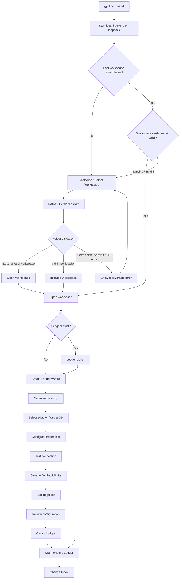
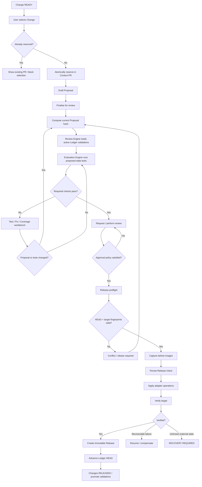

# Gyrifi “gyrif” V3 Implementation Plan and Product Design

## Executive summary

The strongest implementation direction for V3 is to preserve the proposal’s deliberately small domain model—**Ledger → Change → Proposal → Release**—while changing the runtime sequencing to honour the most important operational requirement in your observations: **the synchronous write path ends at a durable SQLite commit; enrichment, target-database inspection, packing, evaluation preparation and other secondary work happen afterwards**. This retains the V3 proposal’s local-first, monolithic architecture while making the ingestion API much easier to reason about and much harder to lose data from. fileciteturn0file0

The resulting product should feel like a local developer tool rather than an infrastructure stack:

```text
Install once
    ↓
gyrif
    ↓
terminal process starts
    ↓
browser opens automatically
    ↓
workspace
    ↓
ledger
    ↓
change inbox
    ↓
context PR
    ↓
evaluate
    ↓
approve
    ↓
release
```

The recommendation is to ship **a self-contained native distribution as the canonical installation**, with `gyrif` as the single run command. Docker may remain an optional headless/development distribution, but it should not be the normal user path because Docker Desktop itself carries OS, virtualisation, installation and—depending on organisational use—licensing prerequisites. npm and Python/pip-style installation similarly introduce runtime/environment dependencies that contradict the requirement that users should not have to know or care what Gyrifi needs underneath. Docker’s own current installation documentation illustrates the host and virtualisation prerequisites involved; npm requires Node.js/npm to be installed; and pipx itself requires a sufficiently recent Python and pip. citeturn0search1turn0search3turn0search6turn1search13turn2search11

For local state, use **one workspace-level SQLite `state.db` in WAL mode with `synchronous=FULL`**, together with a content-addressed object directory for payloads that have graduated out of hot SQLite storage. SQLite serialises writes automatically, WAL permits readers to continue while a writer appends committed transactions, and `synchronous=FULL` in WAL mode provides the durability semantics appropriate to the requirement that an acknowledged Change survive an application/OS crash or power-loss scenario, subject to normal filesystem/hardware guarantees. citeturn0search0turn0search5turn6search6

A crucial refinement to the original proposal is therefore:

```text
API request
    │
    ├─ syntactic + quota + identity validation
    │
    ▼
SQLite transaction
    ├─ idempotency key
    ├─ changeId
    ├─ raw/canonicalisable hot payload
    ├─ ledgerId
    ├─ actor
    ├─ sequence
    └─ status = RECEIVED
    │
    ▼ COMMIT + required durability boundary
HTTP 201/200 success
    │
    └──────────────► Change Engine
                      ├─ canonicalise
                      ├─ inspect target/base
                      ├─ fingerprint
                      ├─ persist immutable object
                      ├─ classify
                      └─ status = READY / BLOCKED
```

This is intentionally different from synchronously reading the target database before acknowledging the incoming request. That distinction follows your explicit observation that *after the Change is safely recorded in SQLite, the rest of the work is not required in the request flow*.

The PR lifecycle should similarly be based on a small number of explicit invariants:

```text
READY Change
    ↓
reserved by exactly one open Proposal
    ↓
Proposal finalised
    ↓
Proposal hash
    ↓
existing Ledger validations + proposal tests
    ↓
Evaluation
    ↓
required checks pass
    ↓
review/approval bound to current proposal state
    ↓
Release Intent persisted
    ↓
target apply + verification
    ↓
immutable Release
    ↓
Ledger HEAD advances
```

The proposal already establishes the value of immutable Release identity, proposal-hash-bound checks and approvals, before-images, optimistic target fingerprint checks, and crash recovery using a persisted Release Intent. Those principles should remain the core correctness model. fileciteturn0file0

The implementation roadmap below is deliberately **UI-first**. Each ticket begins with what the user must see and be able to do, then specifies the minimum API, database, filesystem and background-engine changes required to make that interaction true. The workspace flow also preserves the detailed behaviours in the supplied example ticket—folder validation, existing/new workspace differentiation, permission handling, retry safety and preservation of unrelated files—while standardising the product name to **Gyrifi** and executable/system name to **`gyrif`**. fileciteturn0file1

## Assumptions and target architecture

The implementation plan assumes the V3 proposal and your observations are authoritative, with your newer observations taking precedence where they alter sequencing. The V3 proposal describes Gyrifi as a local-first governance system that owns governance/history rather than duplicating the backing corpus, and argues for a monolith, SQLite-backed transactional metadata and immutable content-addressed history rather than Git, Kafka, Temporal or a mandatory network database. fileciteturn0file0

The following assumptions fill gaps that materially affect implementation.

| Area | Working V3 assumption |
|---|---|
| Product naming | **Gyrifi** is the brand/company. **gyrif** is the executable/system. |
| Runtime | One local `gyrif` process serves both API and embedded web UI. |
| Browser | `gyrif` opens the system browser automatically; it does not require Electron or an always-running desktop shell. |
| Network | UI/API bind to loopback only by default. Remote serving is out of V3 scope. |
| Workspace | User chooses a normal local folder; Gyrif creates a hidden `.gyrif/` repository inside it. |
| Global config | A small OS-user-level config remembers recently/last-used workspaces. It contains no ledger secret values. |
| Ledger | One logical governed context domain; V3 initially allows one backing database connection configuration per ledger. |
| Persistence | One `state.db` per workspace, not one SQLite database per ledger. |
| Ingestion | Accepted Change payload is durably present in SQLite before success is returned. |
| Background processing | An in-process bounded worker queue consumes durable jobs/change states from SQLite; memory queues are acceleration only. |
| PR terminology | Domain object/API name is `Proposal`; UI label is **Context PR**. |
| PR locking | A Change may belong to at most one active Context PR. |
| Reviewers | V3 maintains workspace-local actor/reviewer identities. Full remote multi-user identity infrastructure is out of scope. |
| Evaluation | Existing active Ledger validations are inherited automatically; proposal-local validations can be added during review. |
| Release | Release mutates the target DB only after checks/approval and a persisted Release Intent. |
| Atomicity | UI reports adapter capability honestly: `ATOMIC` where the target provides it, otherwise `RECOVERABLE`. |
| Backup | Back up the Gyrif repository, not the user’s target database unless a future adapter explicitly owns that capability. |
| Rollback | Rollback creates a new forward Release; it never rewinds public history. |
| Retention | Audit metadata is permanent; rollback payload retention is policy/budget driven. |

The proposed repository layout is:

```text
<workspace>/
├── normal user files...
└── .gyrif/
    ├── workspace.json
    ├── state.db
    ├── objects/
    │   ├── loose/
    │   └── packs/
    ├── backups/
    │   └── manifests/
    ├── logs/
    └── tmp/
```

Large immutable historical values should progressively move to the object store, but the initial acknowledged request must not depend on that secondary storage transition. This means `changes.hot_payload` or an equivalent SQLite table retains the complete accepted value until the Change Engine has durably written and verified its object representation. Only then may a later SQLite transaction replace the hot payload with an immutable `object_hash`. This deliberately makes a crash at any point recoverable from SQLite.

A minimal state machine is:

```text
RECEIVED
   ↓
PROCESSING
   ├────► BLOCKED
   │
   ▼
READY
   ↓
RESERVED
   ↓
IN_REVIEW
   ↓
APPROVED
   ↓
RELEASING
   ↓
RELEASED
```

`BLOCKED`, `RECOVERY_REQUIRED`, `ABANDONED` and `SUPERSEDED` are side states rather than additional user concepts.

SQLite should be configured explicitly rather than relying on accidental defaults:

```sql
PRAGMA journal_mode = WAL;
PRAGMA synchronous = FULL;
PRAGMA foreign_keys = ON;
PRAGMA busy_timeout = <bounded value>;
```

SQLite documents that there is only one writer at a time and that it serialises writes itself; in WAL mode readers and a writer can operate concurrently with readers seeing snapshots. SQLite also documents WAL checkpoint starvation when long-lived read transactions prevent a complete checkpoint, so web/API handlers should use short-lived read transactions and never hold a DB cursor open across user think-time or streaming UI sessions. citeturn0search0turn6search6turn6search2

The browser/local-server boundary deserves explicit hardening even though the system is local. Bind only to `127.0.0.1`/`::1`, reject unexpected `Host` and `Origin` values, use same-origin APIs with no wildcard CORS, and establish a per-launch browser session rather than treating “localhost” itself as authentication. State-changing requests should be protected against cross-site request forgery; OWASP recommends token-based CSRF protections and origin/fetch-metadata validation as part of the defence. citeturn4search0

A practical launch sequence is:

```text
gyrif
  │
  ├─ acquire workspace-process lock
  ├─ bind random free loopback port
  ├─ generate one-time bootstrap token
  ├─ start HTTP server
  ├─ open:
  │    http://127.0.0.1:<port>/#bootstrap=<one-time-token>
  │
  └─ terminal displays:
       Gyrif is running
       Workspace: <redacted/name only>
       Open: http://127.0.0.1:<port>
       Press Ctrl+C to stop
```

The fragment token is consumed by the SPA, exchanged once for a server-side session and invalidated; it need not be placed in normal server access logs.

For secrets, store **references** in SQLite, not plaintext secret material. On supported desktop operating systems the preferred secret provider should be the operating-system credential facility; Microsoft explicitly advises against storing credentials as plaintext application data and exposes Credential Locker for desktop applications. OWASP similarly recommends dedicated secrets-management facilities, least privilege, lifecycle controls and preventing secrets from entering logs. citeturn3search4turn5search0

### Startup, workspace and ledger flow



The workspace picker behaviour should follow the supplied example closely: cancelled folder selection is not an error; inaccessible locations block continuation; existing metadata must never be overwritten; retries must be safe; and unrelated files in the selected folder must remain untouched. fileciteturn0file1

## Technical decisions and alternatives

### Installation and distribution

| Choice | User prerequisites | Operational fit | Upgrade/support implications | V3 decision |
|---|---|---|---|---|
| **Self-contained native binary / native installer** | No language runtime or container engine required | Best match for `gyrif` → backend + browser | Gyrifi owns signing, packaging and update channel; build per supported OS/architecture | **Recommended canonical distribution** |
| Docker image | Docker Engine/Desktop plus host/virtualisation configuration | Good for CI/headless/server experiments; poor default local-first onboarding | Image distribution is easy, but Docker installation/licensing/platform support becomes somebody else’s prerequisite | Optional only |
| npm global package | Node.js + npm + PATH/environment | Convenient for Node-native developer audience, but violates “no runtime concern” requirement | Node/npm versions and global-install behaviour become support surface | Do not use as canonical installer |
| pip/pipx package | Python + pip/pipx + environment compatibility | Fine for Python developers; poor universal installer | Python and environment management become part of support matrix | Do not use as canonical installer |
| Desktop wrapper such as full Chromium bundle | Few runtime prerequisites | Native picker/tray integration is easier | Much larger distribution and duplicate browser runtime despite stated browser-first experience | Avoid unless browser/native integration proves impossible |

Docker Desktop has explicit host requirements, including WSL/Hyper-V or virtualisation configurations depending on platform, while npm requires Node/npm installation and pipx requires Python and pip. Those dependencies directly cut against the desired zero-prerequisite user experience. citeturn0search1turn0search3turn1search13turn2search11

For release builds, macOS distributions outside the Mac App Store should be Developer-ID signed and notarised so Gatekeeper can validate publisher identity/tampering and Apple’s notarisation result. Windows releases should likewise be code-signed; Microsoft’s current Smart App Control guidance identifies signed binaries from trusted providers as the relevant trust mechanism. citeturn1search0turn1search1turn1search6

**Recommended distribution contract**

```text
macOS:
    signed + notarised universal/per-architecture binary/package
    optional Homebrew formula as convenience

Windows:
    signed installer + portable signed executable
    optional winget entry

Linux:
    downloadable executable/archive
    optional deb/rpm/package-manager channels later

Canonical runtime:
    gyrif
```

Package-manager commands may be convenience channels, but the artefact underneath should remain the same self-contained application.

### Local database and repository layout

| Option | Concurrency / durability | Advantages | Risks | V3 decision |
|---|---|---|---|---|
| SQLite WAL + `FULL`, one workspace DB, hot payload in SQLite then external immutable objects | Concurrent readers + serialised writer; strong acknowledged-write boundary | Matches local monolith, supports separate read/write flows, easiest crash reasoning | WAL needs checkpoint hygiene; external objects need careful hand-off | **Recommended** |
| SQLite WAL + `NORMAL` | Same concurrency | Fewer sync operations | Recent committed transactions can be lost after system/power failure even though consistency is retained | Reject for acknowledged Change writes |
| SQLite rollback journal | Readers can be blocked around writes | Simpler file set; conventional mode | Worse read/write concurrency for inbox-heavy UI | Not preferred |
| Everything as SQLite BLOBs permanently | Straightforward transactional model | Simplest first implementation | Large historical payload churn bloats DB and couples compaction/history to operational metadata | Fine for prototype, not target V3 |
| Separate SQLite DB per Ledger | Independent files | Failure/backup isolation per ledger | Cross-ledger workspace queries, migration and connection management become more complex | Reject until scale proves need |
| One DB + CAS loose objects/packs | Small hot metadata DB + immutable history | Keeps normal UI queries fast while historical bytes can be packed/archived | Requires `fsck`, object index and careful GC | **Target architecture** |

SQLite WAL is specifically designed to allow reads to continue while writes append to a separate log, and `FULL` synchronous in WAL mode is the appropriate stronger durability choice when losing an acknowledged transaction after power failure is unacceptable. SQLite also warns that long-lived readers can prevent complete checkpoints, which is why the UI/API should use bounded read transactions and expose WAL health. citeturn0search5turn6search6

### Backup method

For `state.db`, prefer the SQLite Online Backup API or an equivalent database-library binding rather than raw-copying the live file. SQLite describes the Online Backup API as producing a consistent database snapshot and allowing copying incrementally while normal database activity continues. `VACUUM INTO` can also create a consistent compact snapshot but uses more CPU and has different interruption characteristics. citeturn6search1turn6search0

A repository backup should be:

```text
1. Disable destructive object GC for backup generation.
2. Take SQLite consistent snapshot.
3. Read all object hashes reachable from that snapshot.
4. Copy/deduplicate referenced immutable objects/packs.
5. Write backup manifest with checksums and schema version.
6. fsync/finish destination.
7. Mark backup COMPLETE.
8. Re-enable ordinary GC.
```

A backup never becomes restorable merely because a directory exists; only a checksum-verified `COMPLETE` manifest should appear in the Restore UI.

### Background-job strategy

| Strategy | Failure isolation | Complexity | Durable-job handling | V3 suitability |
|---|---|---|---|---|
| **In-process bounded worker threads/tasks** | Process crash affects all work | Lowest | SQLite is source of truth; workers claim durable rows | **Recommended** |
| Child worker process managed by `gyrif` | Better crash/CPU isolation | IPC, process lifecycle, duplicate locking and shutdown semantics | Still needs SQLite leases/state | Later option for CPU-heavy evaluation |
| Independent worker daemon | Better isolation/scaling | Introduces second service to install/run | Needs ownership/heartbeats and potentially shared storage | Contradicts V3 simplicity |
| External queue/worker system | High scaling potential | Adds infrastructure and distributed failure modes | Queue becomes another durability system | Explicitly out of scope |

The proposal’s one-process target and SQLite’s built-in serialised writer model make an in-process worker pool the smallest coherent solution. fileciteturn0file0

The critical rule is that **memory is never the authoritative queue**:

```text
wrong:
HTTP → in-memory queue → worker → SQLite

correct:
HTTP → SQLite durable state → commit → HTTP success
                              ↓
                       worker discovers row
```

Worker claiming should itself be transactional, for example:

```text
READY/RECEIVED row
    ↓ BEGIN IMMEDIATE
set processing_owner
set processing_started_at
increment attempt
    ↓ COMMIT
perform work
    ↓
write outcome in new short transaction
```

`SQLITE_BUSY` is expected under competing writers and should be handled with bounded timeout/retry rather than being treated as corruption; SQLite documents both the single-writer constraint and the busy-timeout mechanisms intended for this situation. citeturn6search2

## Implementation roadmap

The tasks are ordered by the UI journey and by dependency. **High** means required for the first useful end-to-end V3 release; **Medium** means necessary for production hardening but can follow the first happy-path slice; **Low** means useful polish or extensibility.

### Foundation, startup and onboarding tasks

**Task ID**

`GRF-101`

**Task**

Implement the self-contained `gyrif` launcher so a user can install the product and start the complete local system with a single `gyrif` command.

**Priority:** High  
**Effort:** L

**UI**

- Running `gyrif` starts the backend and opens the Gyrif web UI in the user’s default browser.
- Terminal shows startup state, application version, browser address, active workspace name when known, and **Press Ctrl+C to stop**.
- Browser shows a short **Starting Gyrif…** screen if the server is still initialising.
- A second launch while the same workspace/process is active should focus/open the existing instance rather than silently create a competing writer.
- If the browser cannot be opened automatically, terminal displays the local address for manual opening.

**Backend / API / Storage**

- Build frontend assets into or alongside the self-contained executable so no Node/Python runtime is needed at execution time.
- Bind HTTP/API to loopback only on an available local port.
- Generate a per-launch one-time browser bootstrap token and establish a local authenticated session.
- Add process-instance locking and graceful shutdown.
- Add `gyrif --version`, `gyrif --no-open`, `gyrif --workspace <path>` and `gyrif doctor`.
- Produce signed release artefacts; notarise macOS distributions and sign Windows distributions. Apple documents Developer ID/notarisation for software distributed outside the Mac App Store, while Microsoft documents code signing as the mechanism for publisher/content validation. citeturn1search0turn1search1turn1search6

**Rules**

- Core execution must not require Docker, Node.js, Python, Redis, Postgres or another separately installed runtime.
- The API must not listen on a non-loopback interface without an explicit future opt-in feature.
- Startup must not expose secrets in terminal output or command-line arguments.
- Only one writer-owning Gyrif process may operate the same workspace.
- A failed browser launch must not shut down an otherwise healthy backend.

**Validation**

1. Install a release artefact and execute `gyrif`.
2. Verify one terminal process starts and the browser opens to the welcome/loading UI.
3. Disable or simulate failure of browser launching.
4. Verify the terminal provides a usable local URL and the server remains running.
5. Restart `gyrif` and verify startup works without requiring any language runtime or container engine.

**Task ID**

`GRF-102`

**Task**

Implement first-run workspace selection and workspace initialisation.

**Priority:** High  
**Effort:** M

**UI**

- Entry screen: **Welcome to Gyrif**.
- Primary action: **Select workspace**.
- Clicking it invokes a native operating-system directory picker through the local backend.
- After selection, show the path, workspace classification and either **Open workspace** or **Initialise workspace**.
- Loading states: **Checking workspace…** and **Creating workspace…**.
- Permission, invalid metadata and unsupported-version errors are shown inline with **Choose another folder** and retry actions.
- Cancelling the picker leaves the user on the same screen without an error.

**Backend / API / Storage**

- Add workspace service:
  - `POST /api/workspaces/picker`
  - `POST /api/workspaces/validate`
  - `POST /api/workspaces/initialise`
  - `POST /api/workspaces/activate`
- Initialise `.gyrif/workspace.json`, `.gyrif/state.db`, `objects/`, `tmp/` and required schema.
- Validation result should distinguish existing workspace, new location, permission denied, corrupt metadata and unsupported version.
- Never send absolute workspace paths to analytics or external telemetry.
- Preserve the supplied example ticket’s retry-safe initialisation and unrelated-file guarantees. fileciteturn0file1

**Rules**

- Selecting a directory never modifies it until **Initialise workspace** is confirmed.
- Existing valid Gyrif metadata must never be overwritten.
- Unrelated files must never be deleted or modified.
- Initialisation is retry-safe.
- Workspace does not become active until all required metadata and DB initialisation succeed.

**Validation**

1. Start without a remembered workspace and select an empty writable folder.
2. Verify the UI identifies it as a new location and successfully initialises it.
3. Select a read-only or invalid workspace.
4. Verify continuation is blocked with the correct actionable error.
5. Restart and verify the newly created workspace can be opened without damaging unrelated files.

**Task ID**

`GRF-103`

**Task**

Persist the last active workspace and automatically reopen it on normal subsequent startup.

**Priority:** High  
**Effort:** S

**UI**

- Normal repeat launch skips the welcome screen and opens the last healthy workspace.
- Show a brief **Opening `<workspace>`…** startup state.
- If the remembered path is unavailable, show **Workspace not found** with **Locate workspace**, **Choose another workspace**, and **Forget reference**.
- Do not silently create a replacement workspace at a missing path.

**Backend / API / Storage**

- Add machine-level application config outside the workspace containing:
  - workspace ID;
  - active path;
  - last-opened timestamp;
  - recent workspace IDs/paths.
- Validate remembered workspace ID against workspace metadata before activation.
- Add migration/version handling for global config.
- Paths remain local-only.

**Rules**

- Auto-open only a workspace that both exists and has matching valid metadata.
- A moved workspace can be re-associated after the user selects its new location and the workspace ID matches.
- Invalid remembered state falls back to onboarding rather than terminating startup.

**Validation**

1. Open a workspace, stop Gyrif and run `gyrif` again.
2. Verify the workspace is opened automatically.
3. Rename/move the directory before restarting.
4. Verify Gyrif offers recovery rather than creating or overwriting anything.
5. Re-locate the same workspace and restart again; verify the corrected location persists.

**Task ID**

`GRF-104`

**Task**

Implement ledger selection and the empty-workspace experience.

**Priority:** High  
**Effort:** M

**UI**

- After workspace activation, show **Ledgers**.
- Existing ledgers display name, adapter type, health, last release and pending-change count.
- Primary actions: **Open ledger** and **Create ledger**.
- Empty workspace shows an intentional onboarding state explaining that a ledger governs one context store.
- Broken or incomplete ledger configurations display **Needs attention** rather than disappearing.

**Backend / API / Storage**

- Add `ledgers` table and:
  - `GET /api/ledgers`
  - `GET /api/ledgers/:id`
  - `POST /api/ledgers/:id/open`
- Add ledger health summary queries.
- Persist most recently opened ledger per workspace as a convenience, without preventing user choice.

**Rules**

- Ledger configuration is workspace-scoped.
- A ledger may be listed even when its backing database is currently offline.
- Opening a ledger must not itself perform mutation against the backing database.
- IDs are immutable even if a ledger is renamed.

**Validation**

1. Open an empty workspace and create fixture ledgers.
2. Verify the list/empty states and health labels.
3. Make one adapter unreachable.
4. Verify the ledger remains visible and is marked as needing attention.
5. Restart and verify ledger metadata remains intact.

### Ledger configuration and repository tasks

**Task ID**

`GRF-105`

**Task**

Implement the first ledger-creation step for ledger identity and naming.

**Priority:** High  
**Effort:** S

**UI**

- Wizard step **Name your ledger**.
- Fields: display name and optional description.
- Preview the stable generated ledger ID separately from the editable name only where useful for advanced users.
- **Continue** remains disabled until the name is valid.
- Duplicate display names produce an inline conflict message.

**Backend / API / Storage**

- Add draft-ledger setup session API or local wizard state.
- Validate name length/characters.
- Generate immutable `ledger_id`.
- Do not write an operational ledger row until final wizard confirmation, or mark unfinished drafts explicitly.

**Rules**

- Display name can change later; ledger ID cannot.
- Names must be unique inside a workspace if the UI relies on them as selectors.
- Cancelling the wizard must not leave a half-operational ledger.

**Validation**

1. Start **Create ledger** and enter a valid name.
2. Verify the wizard proceeds while preserving entered data.
3. Enter a duplicate/invalid name.
4. Verify continuation is blocked with inline guidance.
5. Cancel and reopen ledger selection; verify no active partial ledger was created.

**Task ID**

`GRF-106`

**Task**

Implement backing-store adapter selection and connection configuration.

**Priority:** High  
**Effort:** L

**UI**

- Wizard step **Connect your context store**.
- Adapter cards show supported target types and capability badges such as **Atomic release**, **Recoverable release**, **Exact preview**, or **Fast preview**.
- Selecting an adapter reveals only relevant host/endpoint/database/collection fields.
- **Test connection** provides progressive states: connecting, authenticated, target found, capability detected.
- Technical errors expand into diagnostics without exposing secrets.

**Backend / API / Storage**

- Define adapter capability interface:
  - `read`;
  - `fingerprint`;
  - `compile`;
  - `preview`;
  - `apply`;
  - `verify`;
  - `restore`.
- Add connection-test API.
- Persist non-secret adapter configuration in SQLite.
- Store adapter protocol/config schema version.
- Begin V3 with one production-quality adapter rather than several shallow integrations, consistent with the proposal’s recommendation. fileciteturn0file0

**Rules**

- A successful network connection is not sufficient; configured target/collection/schema must also be validated.
- Never imply atomic release if an adapter cannot guarantee all-or-nothing target visibility.
- Connection testing is read-only.
- Saving connection configuration must not itself mutate target context.

**Validation**

1. Select the supported adapter and enter valid connection details.
2. Verify capability badges and successful connection state.
3. Supply unreachable/unauthorised/wrong-target settings.
4. Verify each condition is distinguished without revealing credentials.
5. Reopen the wizard/ledger and verify non-secret settings persist.

**Task ID**

`GRF-107`

**Task**

Implement secure credential capture, secret storage and secret replacement.

**Priority:** High  
**Effort:** M

**UI**

- Credential fields are masked and clearly marked **Stored securely on this device**.
- Existing saved values display **Configured**, never the actual secret.
- Actions: **Replace**, **Remove**, **Test connection**.
- Copy/reveal is not provided by default.
- If OS secure storage is unavailable, the UI explains the fallback/security implication before use.

**Backend / API / Storage**

- Introduce `SecretStore` abstraction.
- Prefer OS credential store implementations.
- SQLite stores `secret_ref`, provider and metadata, not plaintext values.
- Redact secret-shaped values from structured logs and diagnostics.
- Do not put secrets in URLs, CLI flags, analytics or generated configuration exports.
- Windows explicitly advises against storing credentials in plaintext application data; OWASP recommends dedicated secret-management controls and avoiding secret leakage into logs. citeturn3search4turn5search0

**Rules**

- Secret reads are backend-only.
- UI APIs never return plaintext values after initial submission.
- Replacing a secret is atomic from the configuration perspective.
- Removing a required secret moves the ledger into **Connection required**, not an undefined state.

**Validation**

1. Configure a credential and successfully test the connection.
2. Reload the settings page and verify only **Configured** is shown.
3. Remove or invalidate the secret.
4. Verify the ledger reports an actionable connection error without exposing the old value.
5. Restart and verify valid stored credentials still work while logs contain no secret.

**Task ID**

`GRF-108`

**Task**

Implement ledger storage, rollback-retention and quota configuration.

**Priority:** High  
**Effort:** M

**UI**

- Wizard step **Storage & history**.
- Presets: **Lean**, **Extended**, **Complete**.
- Show explanatory separation between **Audit history** and **Exact rollback data**.
- Advanced fields: maximum ledger bytes, rollback minimum period and pending-change limit.
- Display projected/actual usage once data exists.

**Backend / API / Storage**

- Add ledger quota/retention configuration.
- Track:
  - SQLite bytes;
  - hot pending payload bytes;
  - immutable object bytes;
  - rollback bytes;
  - backup bytes separately.
- Add pre-ingestion quota checks so disk exhaustion is rejected before the filesystem becomes unsafe.
- SQLite exposes `SQLITE_FULL` when it cannot grow, but Gyrif should enforce domain budgets well before that failure point. citeturn6search2

**Rules**

- Audit metadata is not silently deleted to satisfy a storage budget.
- Reduction of exact rollback coverage requires explicit configured policy and visible warning.
- When required storage guarantees cannot be maintained, new Changes may be rejected with a storage-pressure error.
- `Complete` rollback means unbounded historical growth is possible; the UI must state this honestly.

**Validation**

1. Configure a small test quota and ingest data near the threshold.
2. Verify usage/pressure is visible in the UI.
3. Attempt an ingest that would violate the configured hard limit.
4. Verify it is rejected before repository corruption/disk exhaustion and existing history remains readable.
5. Restart and verify quota/usage state persists.

**Task ID**

`GRF-109`

**Task**

Implement backup-policy configuration during ledger setup and in Settings.

**Priority:** Medium  
**Effort:** M

**UI**

- Wizard step **Backups**.
- Options: Off, manual only, scheduled local backup.
- Configure backup directory, schedule and retention count.
- **Test backup location** validates permissions/free-space eligibility.
- Show **Last successful backup**, **Next backup** and **Last failure**.
- Make clear that this backs up Gyrif governance state, not automatically the external target DB.

**Backend / API / Storage**

- Add backup policy tables and scheduler state.
- Use the SQLite Online Backup API/binding for `state.db` snapshots rather than naïvely copying an active DB file; SQLite’s backup API is designed to produce a consistent snapshot while allowing the source to remain active. citeturn6search1
- Add repository backup manifests/checksums.
- Pin referenced objects against GC while a backup is being produced.
- Add backup verification after creation.

**Rules**

- A backup is successful only after its DB snapshot, referenced objects and manifest all verify.
- Partial backups are labelled incomplete and never offered for normal restore.
- Backup failures never delete the last known-good backup.
- Destination must not be inside transient `.gyrif/tmp`.

**Validation**

1. Configure a valid backup directory and trigger **Back up now**.
2. Verify progress and a completed backup appear in the UI.
3. Simulate disk-full/permission failure partway through.
4. Verify the partial backup is not presented as restorable and the prior good backup remains.
5. Restart and verify backup history/policy are retained.

**Task ID**

`GRF-110`

**Task**

Implement ledger-setup review, atomic ledger creation and initial health check.

**Priority:** High  
**Effort:** M

**UI**

- Final wizard page summarises:
  - ledger name;
  - target adapter;
  - target identifier;
  - secret status;
  - release guarantee;
  - storage policy;
  - backup policy.
- Primary action: **Create ledger**.
- Creation displays individual setup stages and redirects to the Ledger Home/Change Inbox.
- Failure leaves the wizard recoverable with previous values preserved.

**Backend / API / Storage**

- Add transactional ledger-creation service.
- Store configuration and generate initial ledger state/HEAD representation.
- Verify required secret references.
- Run final read-only target health test.
- Emit local audit event for ledger creation.

**Rules**

- Ledger creation must be idempotent under button double-click/network retry.
- No target context changes occur during creation.
- A failed creation must not result in a ledger that appears healthy and operational.
- Secret plaintext cannot be included in the created ledger record.

**Validation**

1. Complete all wizard steps and create a ledger.
2. Verify it opens to the Change Inbox with correct health/capability information.
3. Trigger failure during the final transaction or connection revalidation.
4. Verify there is no duplicate/half-created operational ledger and the wizard can retry.
5. Restart and verify a successfully created ledger is fully restored.

### Change ingestion and inbox tasks

**Task ID**

`GRF-111`

**Task**

Implement the durable Change-ingestion API whose success boundary is the committed SQLite Change record.

**Priority:** High  
**Effort:** L

**UI**

- Change Inbox shows newly received Changes immediately.
- Very recent entries can display **Processing** until Change Engine enrichment completes.
- API-originated items show stable `changeId`, received time, actor/source and logical unit.
- Failed enrichment does not make the Change disappear; it becomes **Needs attention**.

**Backend / API / Storage**

- Add `POST /api/v1/ledgers/:ledgerId/changes`.
- Accept an idempotency key.
- In one short write transaction:
  - validate ledger existence/state;
  - enforce request/quota limits;
  - reserve monotonic ledger sequence;
  - generate `change_id`;
  - store complete accepted hot payload;
  - store idempotency mapping;
  - set `status=RECEIVED`;
  - commit.
- Return success **only after commit succeeds**.
- Do not synchronously call the backing database, evaluation engine, object packer or backup system before acknowledgement.
- Configure WAL + `synchronous=FULL` for this durability boundary. SQLite serialises writes and documents `FULL` as the fully durable WAL setting. citeturn0search0turn0search5
- Duplicate idempotency keys return the original Change result.

**Rules**

- HTTP success means the accepted Change can be recovered after immediate server restart.
- Same idempotency key + semantically same request returns the original Change.
- Same idempotency key + materially different payload is a conflict, not a second Change.
- Failure before commit returns failure and must not create a visible accepted Change.
- Post-commit Change Engine failure cannot retroactively turn the API acknowledgement into data loss.

**Validation**

1. Submit a Change and capture its returned `changeId`.
2. Verify it appears immediately in the inbox, initially as `Processing` or `Ready`.
3. Kill the process immediately after acknowledgement and restart it.
4. Verify the exact `changeId` and accepted payload remain and processing resumes.
5. Resubmit the same idempotency key and verify no duplicate Change is created.

**Task ID**

`GRF-112`

**Task**

Implement Change Engine enrichment and durable hot-payload graduation.

**Priority:** High  
**Effort:** L

**UI**

- Inbox status transitions from **Processing** to **Ready for review** without requiring reload.
- Enrichment errors display structured reasons such as **Target unavailable**, **Invalid logical unit**, **Conflict while reading base**, or **Unsupported value**.
- User can **Retry processing** after recoverable failures.

**Backend / API / Storage**

- Build in-process Change Engine workers that discover `RECEIVED`/retryable rows from SQLite.
- Processing performs:
  - canonicalisation;
  - logical-unit validation;
  - target read where required;
  - base fingerprint;
  - after fingerprint;
  - immutable object creation;
  - classification.
- Object creation must be durable before SQLite drops the last hot copy.
- Store worker attempt/lease timestamps so crashes can reclaim abandoned jobs.
- Memory queue may wake workers but is not authoritative.

**Rules**

- Worker operations are idempotent.
- A crashed worker cannot strand a Change permanently in `PROCESSING`.
- Never delete `hot_payload` until the durable object is verified and a committed SQLite reference points to it.
- Recoverable target outages leave the Change safely stored.
- Permanent validation failure produces `BLOCKED`, not silent deletion.

**Validation**

1. Submit a Change while its target database is available.
2. Verify it progresses to **Ready for review** and has base/diff metadata.
3. Kill Gyrif while the Change is `PROCESSING`.
4. Restart and verify processing is reclaimed rather than duplicated or lost.
5. Simulate a target outage, verify **Needs attention**, restore the target and verify retry completes.

**Task ID**

`GRF-113`

**Task**

Implement the dedicated Change read path, Change Inbox filters and Change details.

**Priority:** High  
**Effort:** M

**UI**

- Change Inbox supports status, source, logical unit and date filtering.
- Search by `changeId`.
- Row/detail drawer shows:
  - proposed value summary;
  - base/after fingerprint status;
  - source/actor;
  - processing state;
  - PR reservation;
  - timestamps.
- Empty, loading and paginated states must be explicit.
- Read failures show retry without disrupting ingestion.

**Backend / API / Storage**

- Add read-only endpoints:
  - `GET /changes`;
  - `GET /changes/:changeId`;
  - `GET /changes/:changeId/diff`.
- Use dedicated short-lived read connections/transactions separate from write operations.
- Index `(ledger_id, status, sequence)`, logical unit and proposal reservation fields.
- Use cursor pagination based on stable sequence/ID rather than offset for large histories.
- Never hold a read transaction open across SSE/WebSocket connection lifetime.
- WAL permits readers to operate while a writer commits, but SQLite warns that continuously active readers can prevent checkpoint completion, so DB reads must remain request-scoped. citeturn0search0turn6search6

**Rules**

- Read endpoints never mutate Change state.
- A UI read failure must not block the write-ingestion API.
- Pagination must not duplicate or omit items merely because new Changes arrive.
- Sensitive raw values should be rendered only when the actor is permitted by local policy.

**Validation**

1. Ingest multiple Changes while continuously browsing/filtering the Inbox.
2. Verify reads remain responsive while new writes appear.
3. Trigger a read timeout/database busy condition.
4. Verify the UI retries/recovers without affecting accepted writes.
5. Reload/restart and verify filters may reset but Change data/order remain correct.

**Task ID**

`GRF-114`

**Task**

Implement atomic Change reservation when Changes are selected into a Context PR.

**Priority:** High  
**Effort:** M

**UI**

- Inbox rows eligible for review have checkboxes and **Create Context PR**.
- Changes already reserved show **In PR-…** and cannot be selected for another PR.
- If another browser session reserves a selected item first, creation shows exactly which items became unavailable.
- Selecting a reserved Change can navigate to its existing PR.
- Removing a Change from an editable PR releases it back to the Inbox.

**Backend / API / Storage**

- Add `proposals` and `proposal_changes`.
- Enforce a DB-level uniqueness rule making one Change belong to at most one active proposal.
- `POST /proposals` performs reservation of all selected Change IDs in one SQLite transaction.
- `POST /proposals/:id/changes` and delete counterpart maintain reservation atomically.
- Broadcast reservation changes to active UIs.

**Rules**

- A Change can be reserved by zero or one active Context PR—never two.
- Proposal creation is all-or-nothing for its selected set unless the UI explicitly supports a user-confirmed partial retry.
- Released Changes cannot be placed in a new ordinary PR.
- Closing/abandoning a draft releases its Changes.
- Releasing the PR converts reservations into permanent release association rather than returning them to the Inbox.

**Validation**

1. Open the same Inbox in two browser sessions and select the same Change.
2. Create a PR in the first session and verify it becomes unavailable in the second.
3. Attempt competing PR creation from the stale second session.
4. Verify the API/UI rejects the reservation conflict without partially duplicating ownership.
5. Abandon the first PR and verify the Change becomes selectable again after reload.

### Review, evaluation and approval tasks

**Task ID**

`GRF-115`

**Task**

Implement Context PR creation, finalisation and proposal-state hashing.

**Priority:** High  
**Effort:** M

**UI**

- Context PR page shows title, description, base Release, selected Changes, affected units and author.
- Draft actions: add/remove eligible Changes and **Ready for review**.
- Once content changes, any old evaluation/approval status visibly becomes **Out of date**.
- Advanced metadata shows the proposal digest/hash in a copyable form.

**Backend / API / Storage**

- Canonically represent Proposal content.
- Calculate `proposal_hash` from fields that define reviewed context:
  - ledger;
  - base Release;
  - ordered/canonical Change set;
  - relevant policy/config version.
- Store checks/approvals against the exact hash.
- The V3 proposal explicitly uses proposal hashing to invalidate checks/approvals when a Proposal changes, avoiding a separate user-facing revision entity. fileciteturn0file0

**Rules**

- Adding/removing/replacing a Change changes the current proposal hash.
- Old checks remain in history but cannot satisfy gates for the new hash.
- Old approval similarly becomes stale.
- Finalisation prevents unrelated actors from casually altering the Change set; deliberate **Edit PR** returns it to draft and invalidates prior gates.

**Validation**

1. Create a PR and record its displayed proposal digest.
2. Run a check/approval, then modify its selected Changes.
3. Verify the hash changes and old check/approval is marked stale.
4. Restore the original set and verify the system still treats evaluation identity deterministically according to canonical content.
5. Restart and verify the active hash/history persist.

**Task ID**

`GRF-116`

**Task**

Implement the PR review summary and polished logical Change diff viewer.

**Priority:** High  
**Effort:** L

**UI**

- Context PR opens on **Overview**, with tabs for **Changes**, **Tests**, **Review**, **Release**.
- Changes view has left-hand affected-unit navigation and a large diff surface.
- Support text/JSON/key-value/vector metadata presentations without pretending every context value is line-oriented source code.
- Diff viewer includes **Before**, **After** and **Side by side** modes.
- Show base-drift/conflict warning directly beside affected units.
- Large payloads use collapsed sections and progressive rendering rather than freezing the browser.

**Backend / API / Storage**

- Add logical diff generation from base fingerprint/value and proposed state.
- Adapter may supply structured diff hints.
- Fetch large values lazily.
- Redact configured sensitive fields before display where appropriate.
- Cache derived diffs by immutable input hashes; cache is disposable.

**Rules**

- Diff is a representation of the Change, never its source of truth.
- Missing historical/base content is shown honestly; do not fabricate a before value.
- External target drift detected after Change preparation appears as a conflict.
- Binary/unsupported values receive metadata/hash comparison instead of misleading textual diff.

**Validation**

1. Open a PR containing text, structured and large Changes.
2. Verify each uses the appropriate diff representation and navigation.
3. Externally modify an affected target unit and refresh/revalidate.
4. Verify conflict/drift is prominently indicated and unsafe release becomes blocked.
5. Reload the PR and verify all diff state can be reconstructed from persisted data.

**Task ID**

`GRF-117`

**Task**

Implement Review Engine collection of inherited ledger validations and Evaluation Engine execution against the proposed state.

**Priority:** High  
**Effort:** L

**UI**

- **Tests** tab groups:
  - **Existing ledger validations**;
  - **PR-added validations**.
- **Run evaluation** displays queued/running/pass/fail/error counts.
- Each result identifies the validation, its version, runtime and proposed-state fidelity.
- Existing validations are loaded automatically; the user does not manually re-select the whole suite.
- Unsupported evaluation capability is displayed before running.

**Backend / API / Storage**

- Define versioned validation definitions and ledger-validation association.
- Review Engine snapshots the active validation set for the current Proposal.
- Evaluation Engine receives:
  - `proposal_hash`;
  - test bundle hash/version;
  - adapter preview mode;
  - evaluation policy version.
- Persist each result against exact input identity.
- Expose adapter fidelity: `FAST`, `REFERENCE`, `UNSUPPORTED`, as proposed by V3. fileciteturn0file0

**Rules**

- An evaluation result cannot satisfy a release gate for a different Proposal hash.
- Required inherited validations cannot silently disappear.
- Preview fidelity must be displayed honestly.
- Evaluation-engine failure is different from validation failure.
- Evaluation does not release context.

**Validation**

1. Open a PR on a ledger with pre-existing validations and run evaluation.
2. Verify those validations are automatically included and each result is persisted.
3. Change the PR or validation definition and rerun.
4. Verify previous results become historical/stale rather than satisfying the new run.
5. Restart and verify completed run results remain inspectable.

**Task ID**

`GRF-118`

**Task**

Implement the test/fix/coverage workbench for failing validations and new-context coverage.

**Priority:** High  
**Effort:** L

**UI**

- Failed tests open into a focused workbench containing:
  - validation expectation;
  - actual result;
  - affected Change/context unit links;
  - **Edit validation** where permitted;
  - **Add validation**;
  - **Return Change to draft / modify PR** workflow.
- Coverage panel shows which affected logical units/behaviours are exercised by validations.
- New PR-local tests are labelled **Added in this PR**.
- **Re-run failed** and **Run all** are separate actions.

**Backend / API / Storage**

- Add proposal-local validation definitions.
- Define promotion semantics: PR-added validations become ledger validations on successful Release unless explicitly marked temporary.
- Calculate coverage using declared logical-unit/test associations first; do not pretend semantic coverage can always be inferred automatically.
- Editing a test generates a new test-definition version.
- Recompute evaluation input digest when validation definitions change.

**Rules**

- Fixing a validation cannot mutate a historical validation definition in place.
- Context changes and test-definition changes that affect review state invalidate relevant evaluation results.
- Required test failures block approval/release.
- Optional/advisory tests may fail without blocking if policy explicitly says so.
- “Coverage” must indicate its definition; it is not an invented universal percentage.

**Validation**

1. Run a PR with a deliberate failing inherited validation.
2. Add/fix a validation and rerun only the affected tests.
3. Modify the PR context after a passing run.
4. Verify affected results/coverage become stale and release remains blocked until valid checks rerun.
5. Release a PR with a new persistent validation and verify it appears in the Ledger validation set afterwards.

**Task ID**

`GRF-119`

**Task**

Implement reviewer assignment, self-review policy and approval bound to the current reviewed state.

**Priority:** High  
**Effort:** M

**UI**

- **Review** tab shows requested reviewers, evaluation state and approval requirements.
- Actions: **Request review**, **Approve**, **Request changes**, **Revoke approval**.
- Workspace actor picker supports assigning oneself or configured local reviewers.
- Approval clearly shows which proposal state/check state it applies to.
- Stale approvals turn visually neutral with **Approval no longer applies because the PR changed**.

**Backend / API / Storage**

- Add workspace actors/reviewer directory.
- Add review requests and approvals with actor, timestamp and proposal/review digest.
- Add ledger approval policy:
  - minimum approval count;
  - self-approval allowed/blocked;
  - required evaluation state.
- Persist audit events.

**Rules**

- Approval is only valid for the current review digest.
- Reviewer assignment alone is not approval.
- If self-approval is disabled, author cannot satisfy the required reviewer count.
- Editing the Proposal or required validation bundle invalidates applicable approval.
- A historical approval record is never erased merely because it became stale.

**Validation**

1. Assign a reviewer and approve a fully passing PR.
2. Verify approval satisfies the configured policy.
3. Modify a Change or required validation afterwards.
4. Verify approval becomes stale and release is blocked.
5. Restore valid evaluation/approval and restart; verify provenance remains intact.

### Release, recovery and operational tasks

**Task ID**

`GRF-120`

**Task**

Implement the Release preflight UI and durable Release Intent creation.

**Priority:** High  
**Effort:** L

**UI**

- **Release** tab summarises:
  - current Ledger HEAD;
  - PR base;
  - checks;
  - approvals;
  - adapter guarantee;
  - affected units;
  - conflicts;
  - rollback-data estimate.
- **Release context** opens a confirmation panel explaining exactly what will be written.
- Preflight stages show progress independently.
- Failed preflight never displays a release as started.

**Backend / API / Storage**

- Acquire per-ledger release lock.
- Re-read current HEAD.
- Verify Proposal base/rebase state.
- Re-read affected target fingerprints.
- Compile physical adapter operations.
- Capture/persist required before-images.
- Persist immutable/restartable `release_intent` before external mutation.
- The V3 proposal specifically identifies this persisted intent as the mechanism needed to recover the crash window between Gyrif metadata and the external target database. fileciteturn0file0

**Rules**

- Exactly one Release executes per ledger at a time.
- Required checks/approvals must match current review state.
- Unexpected target fingerprint blocks release.
- No target write occurs before the Release Intent and required recovery data are durable.
- Another PR advancing HEAD forces rebase/conflict analysis.

**Validation**

1. Prepare a passing approved PR and open Release preflight.
2. Verify target/HEAD/approval checks complete before target mutation.
3. Introduce target drift or advance HEAD from another release.
4. Verify release is blocked with conflict/rebase information and no target mutation occurs.
5. Restart after successful preflight but before apply and verify the persisted intent is discovered.

**Task ID**

`GRF-121`

**Task**

Implement Release execution, target verification and crash recovery.

**Priority:** High  
**Effort:** L

**UI**

- Release progress displays **Preparing → Applying → Verifying → Released**.
- During restart recovery, show **Recovering interrupted release** rather than normal ready state.
- If state cannot be safely classified, ledger enters **Recovery required** with read-only diagnostics and no destructive retry button.
- Success shows immutable Release ID and updated HEAD.

**Backend / API / Storage**

- Implement restartable release-intent state machine.
- Apply adapter operations idempotently where possible.
- Verify target after apply.
- On restart classify affected target units:
  - all expected-before → apply had not taken effect;
  - all desired-after → finish metadata commit;
  - known mixture → resume/compensate according to adapter;
  - unexpected third state → `RECOVERY_REQUIRED`.
- Only after verified success:
  - create immutable Release object;
  - advance HEAD;
  - mark Changes released;
  - promote PR validations;
  - complete intent.

**Rules**

- `HEAD` must never point to a Release that Gyrif knows is incomplete.
- Recovery must never blindly replay a non-idempotent physical command.
- Unknown external drift stops automation.
- Release history is append-only.
- Rollback/recovery data are retained according to configured policy.

**Validation**

1. Release an approved PR and verify target state plus new Release/HEAD.
2. Inject process termination between external target apply and metadata completion.
3. Restart Gyrif.
4. Verify it classifies actual target state and either completes safely or presents **Recovery required**, never claiming a false clean release.
5. Restart after final completion and verify Release/HEAD remain stable.

**Task ID**

`GRF-122`

**Task**

Implement release history, release details and forward rollback workflow.

**Priority:** Medium  
**Effort:** L

**UI**

- Ledger **History** shows immutable Releases in chronological/parent order.
- Release detail includes author, proposal, approvals, test result summary, affected units, parent and adapter guarantee.
- Eligible Releases expose **Restore this state**.
- Restore action creates a new Context PR showing the reverse changes before anything is written.
- History visually shows `R44 → R45 (restores state from R41)` rather than moving HEAD backwards.

**Backend / API / Storage**

- Add release-history and unit-history indexes.
- Compose desired historical state from retained before-images.
- Generate a normal Proposal for rollback.
- Reuse evaluation, approval and release path.
- Record `reverts_to`/restoration reference on resulting Release.
- This follows the proposal’s forward-history model rather than rewriting the release graph. fileciteturn0file0

**Rules**

- Rollback never rewinds HEAD.
- Exact rollback is available only while required payloads remain within retention.
- Missing retention data must produce an explicit unavailable state.
- External drift still participates in normal conflict/preflight rules.

**Validation**

1. Create several Releases affecting the same logical unit.
2. Select an older Release and initiate **Restore this state**.
3. Verify Gyrif creates a reviewable PR rather than mutating immediately.
4. Remove required rollback payload in a test fixture according to expiry policy.
5. Verify unavailable exact rollback is stated honestly and historical audit metadata remains.

**Task ID**

`GRF-123`

**Task**

Implement in-app notifications and durable operational events for Changes, reviews, evaluation, release and backup activity.

**Priority:** Medium  
**Effort:** M

**UI**

- Bell/activity control displays actionable local events.
- Toasts are used for immediate acknowledgement; durable events remain in Activity.
- Event types include:
  - Change ready/blocked;
  - PR assigned;
  - evaluation completed/failed;
  - approval stale;
  - release completed/recovery required;
  - backup completed/failed;
  - storage pressure.
- Repeated background updates are grouped rather than producing toast storms.

**Backend / API / Storage**

- Add append-only local `events` table.
- Stream state changes through SSE or equivalent connection that does **not** hold SQLite read transactions open.
- Add read/unread acknowledgement separate from domain state.
- Persist severe operational events across restart.

**Rules**

- Notification loss cannot change domain correctness.
- Toast delivery is best-effort; durable Activity is authoritative for user-visible operational history.
- Secrets, raw credentials and unrestricted payload content must not enter notification text.
- Critical recovery/storage-pressure events cannot be silently auto-dismissed.

**Validation**

1. Trigger Change processing, evaluation and release completion.
2. Verify appropriate toast/activity entries appear without manual reload.
3. Disconnect/reconnect the browser during events.
4. Verify domain state remains correct and durable events are visible after reconnection.
5. Restart and verify critical unread events remain.

**Task ID**

`GRF-124`

**Task**

Implement repository backup execution, backup verification and guided restore.

**Priority:** Medium  
**Effort:** L

**UI**

- Settings → **Backups** lists completed/incomplete backups with creation time, size and verification state.
- **Back up now** shows progress.
- **Verify** reruns checksums/repository consistency.
- **Restore** requires selecting a backup, verifying it, viewing target workspace impact and explicitly confirming.
- During restore, normal ledger operations are blocked.

**Backend / API / Storage**

- Implement snapshot procedure described above using SQLite’s consistent backup mechanism. citeturn6search1
- Copy immutable reachable objects and manifest hashes.
- Restore into staging repository first.
- Run schema/integrity/object-reference checks before switching active state.
- Keep pre-restore repository as recovery copy until successful startup.
- Never overwrite current data incrementally from an unverified backup.

**Rules**

- Restore is all-or-nothing at workspace-repository level.
- Incomplete or checksum-invalid backups cannot be restored normally.
- Restore must not overwrite the user’s external context DB.
- Secrets need their own backup strategy/reference semantics because OS credential-store entries may not be portable with repository files.

**Validation**

1. Create and verify a backup, then mutate repository state.
2. Restore the prior backup and verify expected Gyrif state returns.
3. Corrupt one backup object or DB snapshot.
4. Verify Restore is blocked before active repository replacement.
5. Restart after a successful restore and run repository consistency verification.

**Task ID**

`GRF-125`

**Task**

Implement Settings for workspace, ledger connection, storage, security and diagnostics.

**Priority:** Medium  
**Effort:** M

**UI**

- Settings areas: **General**, **Connection**, **Storage & history**, **Backups**, **Review policy**, **Security**, **Diagnostics**.
- Destructive/configuration-impacting changes show consequence summaries.
- Connection settings show credential state without plaintext.
- Storage settings show current and projected utilisation.
- Diagnostics can copy a redacted support bundle.

**Backend / API / Storage**

- Add configuration versioning and validation.
- Separate configuration writes from secrets.
- Generate redacted diagnostics including app version, schema version, SQLite health, WAL/checkpoint health, worker state and adapter error categories.
- Never include full credentials, raw context payloads or unrestricted local paths in default support bundles.
- OWASP recommends ensuring secret values are not logged and limiting exposure to principals that need them. citeturn5search0

**Rules**

- Settings changes affecting review/release guarantees may invalidate outstanding review state.
- Lowering rollback retention clearly identifies future consequences.
- Target connection modification while a release is active is blocked.
- Security-sensitive changes require explicit confirmation.

**Validation**

1. Modify a safe setting and verify immediate/persisted behaviour.
2. Attempt to alter target connection during an active release fixture.
3. Verify the UI blocks the unsafe change with an explanation.
4. Export diagnostics and inspect for configured test secrets/raw payload.
5. Restart and verify saved settings remain while secrets are still separately protected.

**Task ID**

`GRF-126`

**Task**

Implement repository health, failure recovery and `gyrif doctor` as the final user-facing resilience layer.

**Priority:** High  
**Effort:** L

**UI**

- Startup detects and reports:
  - database unavailable/corrupt;
  - unfinished migration;
  - oversized/stuck WAL;
  - missing object;
  - interrupted Release;
  - failed Change jobs;
  - low disk space.
- Normal recoverable states have explicit **Retry**, **Repair index**, **Open diagnostics** or **Restore backup** actions.
- Dangerous integrity failures place affected ledger/workspace in read-only recovery mode.

**Backend / API / Storage**

- Implement repository consistency checker:
  - SQLite integrity/schema;
  - Release/HEAD graph;
  - hot payload/object references;
  - pack/object checksums;
  - stuck worker leases;
  - incomplete intents;
  - backup manifests.
- Monitor WAL/checkpoint condition. SQLite documents that overlapping long-lived readers can prevent checkpoint reset and allow WAL growth, so this should be observable rather than invisible. citeturn6search6
- Add repairable secondary-index rebuilds.
- Never auto-repair canonical history by deleting unexplained records.
- Map SQLite `BUSY`, `FULL`, `CORRUPT`, `READONLY` and I/O categories into meaningful operational errors. SQLite defines these errors separately and provides busy-handling mechanisms for expected writer contention. citeturn6search2

**Rules**

- Repair may rebuild disposable indexes/caches but cannot silently rewrite canonical governance history.
- Data uncertainty prefers read-only/recovery state over speculative mutation.
- Interrupted work is resumed only where its state machine proves the operation safe.
- Users are shown what remains safe to use.

**Validation**

1. Run `gyrif doctor` against a healthy workspace and verify a clean result.
2. Inject an incomplete Change job, stale worker lease and interrupted Release fixture.
3. Restart/run diagnostics.
4. Verify each is classified correctly and only safe automated recovery is offered.
5. Complete recovery and restart again; verify the repository returns to healthy state with no lost accepted Change.

### Delivery order

The smallest vertical product slices should be implemented in this order:

| Slice | Required tasks | Demonstrable outcome |
|---|---|---|
| Runnable shell | GRF-101–104 | `gyrif` opens the browser, selects/reopens workspace and selects ledgers |
| Configured ledger | GRF-105–110 | New Ledger can be completely configured without editing files |
| Durable Change inbox | GRF-111–114 | API writes survive crashes and Changes can be exclusively selected for PR |
| Reviewable PR | GRF-115–119 | Diff, inherited tests, fixes/new tests and approvals work |
| Safe release | GRF-120–121 | Approved context is applied with persisted recovery intent |
| History/resilience | GRF-122–126 | Rollback, notifications, backup/restore, settings and recovery are production-usable |

The most important “do not reorder” constraints are:

```text
durable Change ingestion
    before
Change Engine optimisation

Proposal locking/hash semantics
    before
approval

Evaluation identity
    before
release gating

Release Intent
    before
external apply

verified backup
    before
restore

normal Release correctness
    before
rollback
```

## design.md

The design should make Gyrif feel like a **precise local engineering instrument**, not a generic SaaS admin dashboard and not a GitHub imitation. The interface should communicate four ideas extremely clearly:

```text
What context is pending?
What exactly will change?
Is the proposed state safe?
What became live?
```

### Product personality and visual language

Gyrif should have a restrained “ledger/workbench” identity: light surfaces, disciplined borders, dense-but-readable data presentation, strong typography and selective colour. Avoid gradient-heavy hero panels, oversized dashboard cards, AI sparkles, chat bubbles and decorative “agent” imagery.

The UI hierarchy should resemble a high-quality database/editor tool:

```text
persistent navigation
+
dense domain list
+
focused work surface
+
contextual inspection panel
```

The visual system should use colour primarily for state, not decoration.

**Typography**

Recommended UI stack:

```css
font-family:
  Inter,
  ui-sans-serif,
  system-ui,
  -apple-system,
  BlinkMacSystemFont,
  "Segoe UI",
  sans-serif;
```

Technical identifiers, fingerprints, Change IDs and JSON should use:

```css
font-family:
  "IBM Plex Mono",
  "SFMono-Regular",
  Consolas,
  monospace;
```

Use the following practical scale:

| Token | Size / line height | Use |
|---|---:|---|
| `display` | 32 / 40 | Welcome/onboarding only |
| `h1` | 24 / 32 | Screen title |
| `h2` | 18 / 26 | Section title |
| `body` | 14 / 21 | Primary application text |
| `body-sm` | 13 / 19 | Dense tables/metadata |
| `label` | 12 / 16, medium | Field/status labels |
| `mono` | 12–13 / 18 | IDs, code, JSON |

Do not use 11 px metadata simply to make tables denser.

**Palette**

A restrained neutral base with a slightly cool technical character:

| Role | Suggested token | Intent |
|---|---|---|
| App background | `#F7F8FA` | Quiet workspace |
| Surface | `#FFFFFF` | Panels/dialogs |
| Raised surface | `#FBFCFD` | Secondary sections |
| Primary text | `#18202A` | High readability |
| Secondary text | `#586474` | Metadata |
| Border | `#DDE2E8` | Structural separation |
| Strong border | `#B8C1CC` | Active/divider |
| Brand/primary | `#4458D9` | Main actions/active navigation |
| Brand hover | `#3447C4` | Interaction |
| Success | `#247A4B` | Passed/released |
| Warning | `#9A6500` | Storage pressure/stale |
| Danger | `#B42332` | Failed/conflict/destructive |
| Information | `#2467A7` | Processing/advisory |

These exact hex values are design proposals, not accessibility guarantees by themselves; final component combinations must be tested. WCAG 2.2 requires at least 4.5:1 contrast for normal-size text at Level AA, with separate non-text contrast requirements for essential graphical controls. citeturn8search2turn8search1turn8search4

State must never rely solely on hue:

```text
✓ Passed
! Stale
× Failed
● Processing
◆ Conflict
```

with icons, labels and colour used together. WCAG specifically requires information not to depend solely on colour. citeturn8search6

**Spacing**

Use a 4 px base grid:

```text
4   micro gap
8   inline gap
12  compact component gap
16  default component/panel gap
24  section gap
32  major section gap
48  onboarding layout gap
```

Application shell:

```text
sidebar              232 px desktop
secondary list       280–360 px when present
content max width    unconstrained for diff/workbench
form max width       680–760 px
top bar              56 px
standard field       40 px
primary button       40 px minimum
```

Although WCAG 2.2’s Level-AA target-size minimum is 24 × 24 CSS pixels under its defined conditions, Gyrif should normally use **at least 36–40 px interactive rows/buttons** because this is an operational tool where mis-clicks can have consequences. citeturn7search0

### Component system

The design library should be small and domain-specific.

**Application shell**

```text
┌───────────────────────────────────────────────────────────┐
│ workspace / ledger                 health       activity │
├──────────────┬────────────────────────────────────────────┤
│ Overview     │                                            │
│ Changes      │          current route                     │
│ Context PRs  │                                            │
│ History      │                                            │
│ Validations  │                                            │
│ Settings     │                                            │
└──────────────┴────────────────────────────────────────────┘
```

Global context always shows workspace and ledger. Users must never wonder “which ledger am I releasing?”

**Status badge**

Not generic coloured pills everywhere. Reserve compact badges for actual lifecycle states:

```text
[ Processing ]
[ Ready ]
[ PR-142 ]
[ Checks failed ]
[ Approved ]
[ Released ]
[ Recovery required ]
```

**Risk banner**

Used for conflict, recovery, storage exhaustion or target disconnect:

```text
┌─ Conflict detected ────────────────────────────────────────┐
│ 3 target units changed after this PR was prepared.        │
│ Release is blocked until the proposal is rebased.         │
│                                      [Review conflicts]    │
└────────────────────────────────────────────────────────────┘
```

**Timeline**

Release/evaluation activity should use a compact timeline rather than generic notification cards.

**Command/action bar**

Contextual screen actions remain in a predictable upper-right region. Destructive/irreversible operations do not move between screens.

**Confirmation dialog**

Use only when an action has meaningful consequence: abandon PR, remove secret, reduce retention, release context, restore backup. WAI-ARIA guidance requires modal focus to enter the dialog, remain inside while open and return appropriately when closed. citeturn7search1

**Diff primitives**

The diff system needs value-type-aware components:

```text
TextDiff
StructuredObjectDiff
KeyValueDiff
VectorMetadataDiff
DeletionDiff
OpaqueValueDiff
```

Do not force vector or structured context into Git-style red/green line diffs where it does not carry meaning.

### Micro-interactions

Animations should be subtle and functional.

- Checkbox-to-PR reservation updates immediately and then confirms server ownership.
- Newly received Change row softly appears without moving the user’s current scroll position unexpectedly.
- Status transitions use 120–180 ms opacity/background transitions.
- **Run evaluation** transforms into a progress control in place rather than creating a modal.
- Successful copy of a Change/Release ID briefly changes the icon to a check.
- Release progress advances between explicit persisted phases, not fake percentage interpolation.
- When an approval goes stale, it should transition to neutral/warning rather than disappear.
- Toasts auto-dismiss only for low-risk success/information messages; errors requiring action remain in Activity.

Respect `prefers-reduced-motion`.

Keyboard focus should be visually unmistakable. W3C’s enhanced focus guidance describes a visible indicator comparable to at least a 2 CSS-pixel perimeter with sufficient contrast; adopting this even where the criterion is AAA creates a much stronger engineering-tool experience. citeturn7search2

### Welcome and workspace onboarding

**Annotated wireframe: first run**

```text
┌──────────────────────────────────────────────────────────────┐
│                                                              │
│                         GYRIFI                               │
│                                                              │
│                     Welcome to Gyrif                         │
│                                                              │
│    Gyrif keeps context changes, reviews and release          │
│    history in a local workspace you control.                 │
│                                                              │
│                  [ Select workspace ]                        │
│                                                              │
│    Your workspace stays on this machine.                     │
│    Gyrif will not modify unrelated files in the folder.      │
│                                                              │
└──────────────────────────────────────────────────────────────┘
```

Annotation:

- No sidebar during first-run onboarding.
- Do not ask users about SQLite, object stores, WAL or repository layout.
- One conceptual decision per screen.
- “Local” is a reassurance, not a marketing banner.

After folder selection:

```text
┌──────────────────────────────────────────────────────────────┐
│  ← Back                                                       │
│                                                              │
│  Workspace                                                   │
│                                                              │
│  ~/Projects/customer-context                                 │
│  ✓ This folder can be used by Gyrif.                         │
│                                                              │
│  No existing Gyrif workspace was found.                      │
│  Existing files will not be changed.                         │
│                                                              │
│              [Choose another] [Initialise workspace]         │
└──────────────────────────────────────────────────────────────┘
```

Existing workspace changes the primary action to **Open workspace**. Permission/invalid-state errors retain the selected path and give recovery options, following the supplied workspace ticket. fileciteturn0file1

### Ledger creation experience

The ledger wizard should use a visible four-step progression without overwhelming users:

```text
Ledger setup

● Identity
○ Connection
○ Storage
○ Review
```

Connection and secrets belong conceptually together in the visible flow even though they are separate implementation tickets.

**Connection screen**

```text
┌─────────────────────────────────────────────────────────────┐
│ Create ledger                                   Step 2 of 4 │
│                                                             │
│ Connect your context store                                  │
│                                                             │
│ Database type                                               │
│ ┌─────────────────┐  ┌─────────────────┐                    │
│ │ Qdrant          │  │ Future adapter  │                    │
│ │ ✓ Supported     │  │ Coming later    │                    │
│ │ Recoverable     │  │                 │                    │
│ └─────────────────┘  └─────────────────┘                    │
│                                                             │
│ Endpoint                                                    │
│ [ http://127.0.0.1:6333________________________ ]           │
│                                                             │
│ Collection                                                  │
│ [ support-context_______________________________ ]           │
│                                                             │
│ API key                                                     │
│ [ •••••••••••••••••••••________________________ ]          │
│ Stored securely on this device                              │
│                                                             │
│ [ Test connection ]                                         │
│                                                             │
│ ✓ Connected · collection found                             │
│ Preview: Fast + Reference                                   │
│ Release guarantee: Recoverable                              │
│                                                             │
│                                      [Back] [Continue]      │
└─────────────────────────────────────────────────────────────┘
```

Capability words should be explainable with tooltips:

```text
Recoverable
The target may expose partial application under some failures.
Gyrif records enough state to detect and recover safely.
```

This is preferable to falsely applying a reassuring “Atomic” badge to every adapter; the V3 proposal explicitly calls for capability-specific honesty. fileciteturn0file0

### Main ledger shell and Change Inbox

**Annotated wireframe**

```text
┌────────────────────────────────────────────────────────────────────────┐
│ Customer Support Context     Qdrant · Healthy      🔔 2        Settings │
├────────────────┬───────────────────────────────────────────────────────┤
│ Overview       │ Changes                                    128 pending │
│ Changes      ● │                                                       │
│ Context PRs    │ [Search changes…] [Status ▾] [Source ▾]               │
│ History        │                                                       │
│ Validations    │ □  Change               Status       Received         │
│ Settings       │ ───────────────────────────────────────────────────── │
│                │ □  chg_8F21  Refund     Ready        2 min ago        │
│                │ □  chg_8F20  Warranty   Processing   2 min ago        │
│                │ ☐  chg_8F19  Shipping   PR-142       4 min ago        │
│                │                                                       │
│                │                              2 selected                │
│                │                       [Create Context PR]              │
└────────────────┴───────────────────────────────────────────────────────┘
```

The `PR-142` row’s checkbox is unavailable because Change ownership is exclusive.

Selecting a row opens an inspection drawer instead of navigating away:

```text
Change chg_8F21
────────────────────────
Refund policy
PUT

Received
Alice · API
12 Aug 2026 · 14:21

Base
sha256:7bc…

Proposed
sha256:191…

[View diff]
```

Processing state should communicate that **acceptance and enrichment are different**:

```text
✓ Change safely received
● Inspecting current target state…
```

This reinforces the durable-write semantics without exposing SQLite internals.

### Context PR review

The PR page should be the visual centre of Gyrif.

```text
┌────────────────────────────────────────────────────────────────────────┐
│ PR-142 · Update cancellation policy                     Ready for review│
│ 60 Changes · 54 units · Base R-91FA                                     │
│                                                                         │
│ Overview   Changes   Tests  58/60 ✓   Review   Release                  │
├─────────────────────────────────────────────────────────────────────────┤
│                                                                         │
│  Review summary                                  Required checks         │
│                                                  ✓ 58 passed             │
│  This PR changes 54 logical units.               × 2 failed             │
│  12 have new validation coverage.                                        │
│                                                  Reviewers               │
│  ◆ 1 target conflict                             Alice     Pending        │
│                                                  Dev B     Requested      │
│  [Review conflict]                               [Request review]         │
│                                                                         │
│  Recent evaluation                                                     │
│  Reference Preview · 12 Aug 14:42                                      │
│  ███████████████████████████████████ 58 passed                         │
│  ██ 2 failed                                                           │
│                                                                         │
│  [Open failing tests]                                                   │
└─────────────────────────────────────────────────────────────────────────┘
```

The page should avoid a single giant “merge button”. Release becomes available only after prerequisites are satisfied, and the Release tab explains why it is unavailable.

### Change diff viewer

**Annotated wireframe**

```text
┌───────────────────────────────────────────────────────────────────────────┐
│ PR-142 / Changes                                                          │
├─────────────────────┬─────────────────────────────────────────────────────┤
│ 60 changes          │ Enterprise cancellation policy                     │
│                     │ policy/cancellation/enterprise                      │
│ ● Cancellation      │                                                     │
│   Refund            │ [Side by side ▾]        Base R-91FA                │
│   Warranty          │                                                     │
│   Shipping          │ ┌────────────────────┬────────────────────────────┐ │
│   …                 │ │ BEFORE             │ PROPOSED                   │ │
│                     │ │                    │                            │ │
│                     │ │ period_days: 30    │ period_days: 60           │ │
│                     │ │ tier: enterprise   │ tier: enterprise          │ │
│                     │ │                    │                            │ │
│                     │ └────────────────────┴────────────────────────────┘ │
│                     │                                                     │
│                     │ Impact                                              │
│                     │ 3 inherited tests · 1 new test                      │
│                     │ ✓ 3 passed · × 1 failed                            │
│                     │                                                     │
│                     │ [Open failing test]                                 │
└─────────────────────┴─────────────────────────────────────────────────────┘
```

Use red/green as secondary cues only; changed fields additionally receive `−`/`+`, labels and structural emphasis.

For long JSON:

```text
address
  country              "UK" → "GB"
  metadata
    cancellation_days  30 → 60
    internal_note      unchanged
```

This is more useful than presenting 800 lines of pretty-printed JSON when only two paths changed.

### Test and coverage workbench

```text
Tests
──────────────────────────────────────────────────────────────

Inherited from Ledger                          58 passed · 2 failed
┌────────────────────────────────────────────────────────────┐
│ × Enterprise cancellation retrieval                       │
│   Expected: policy with cancellation period 60 days       │
│   Actual:   old policy ranked first                        │
│                                                            │
│   Affected Changes                                         │
│   chg_8F21 · chg_8F38                                      │
│                                                            │
│   [View proposed state] [Edit test] [Re-run]               │
└────────────────────────────────────────────────────────────┘

Added in this PR                                      4 passed
+ Add validation

Coverage
54 affected logical units
41 directly covered
13 without explicit validation associations

[Show uncovered changes]
```

“Coverage” is intentionally described as **explicit validation coverage of changed logical units**, unless Gyrifi later has a more rigorous domain-specific coverage measure. A misleading universal 92% number would create false confidence.

### Approval and release interaction

Approval:

```text
Review
────────────────────────────────────────────────────

Required
✓ Evaluation gates passing
✓ No unresolved target conflicts
○ 1 approval required

Requested
Alex Morgan                Waiting

[Approve PR]
```

After Proposal mutation:

```text
! Review state changed

The Change set or required validations changed after
the last approval.

Alex Morgan
Approved 14:52 · No longer current

[Run evaluation]
```

Release confirmation:

```text
Release context
────────────────────────────────────────────────────

This will update 54 logical context units in:
Customer Support Context

Target
Qdrant / support

Guarantee
Recoverable

Before release Gyrif will:
✓ Re-check target fingerprints
✓ Capture required rollback data
✓ Persist a recovery intent

After this begins, do not manually modify the same
target units until Gyrif finishes.

[Cancel]                         [Release context]
```

The wording tells users what matters rather than presenting generic “Are you sure?” copy.

### PR lifecycle



### Notifications

Notifications should have three layers:

```text
Toast
    transient acknowledgement

Activity
    durable user-facing event history

Risk banner
    persistent problem affecting current work
```

Examples:

```text
✓ Evaluation complete
58 passed · 2 failed
[Open tests]
```

```text
! Storage pressure
Exact rollback storage is at 86% of the configured budget.
[Review storage]
```

```text
× Release recovery required
The target contains an unexpected value for 1 affected unit.
No further release will run automatically.
[Open recovery]
```

Do not use OS-native notifications in the first V3 unless there is a demonstrated need. Browser/in-app notifications avoid permission prompts and keep sensitive ledger names out of lock screens.

### Settings

Settings should avoid one giant configuration form.

```text
Settings
  General
  Connection
  Storage & history
  Backups
  Validations
  Review policy
  Security
  Diagnostics
```

Connection has an intentionally guarded layout:

```text
Connection
─────────────────────────────────────

Adapter
Qdrant

Endpoint
http://127.0.0.1:6333

Collection
support

Credential
✓ Configured in secure storage
[Replace credential]

Health
✓ Connected
Checked 21 seconds ago

Capabilities
Preview       Fast, Reference
Release       Recoverable

[Test connection]
```

Secret forms never pre-populate plaintext values.

### Error and recovery design

Errors should be categorised by **what the user can do next**, not by stack trace.

```text
Transient
“Target database is unavailable.”
[Retry]

Configuration
“Authentication was rejected.”
[Open connection settings]

Conflict
“3 context units changed outside Gyrif.”
[Review conflict]

Capacity
“Ledger storage budget has been reached.”
[Review storage]

Integrity
“An object referenced by Release R-… is missing.”
[Open diagnostics] [Restore backup]

Recovery
“Gyrif cannot safely determine whether this release completed.”
[Inspect recovery]
```

Every error component can include **Technical details** as an expandable region containing redacted codes, IDs and timestamps suitable for debugging.

`SQLITE_BUSY` should usually surface internally as controlled retry rather than a scary user error, whereas `SQLITE_FULL`, `CORRUPT`, `READONLY` and I/O failure categories deserve specific user-facing handling because they have materially different recovery actions. SQLite defines these as distinct result categories. citeturn6search2

### Accessibility

The target should be **WCAG 2.2 AA**, with selected stronger practices.

All screens must support complete keyboard operation. Dialog focus is trapped appropriately and returned to the invoking control after close, following the WAI-ARIA dialog pattern. citeturn7search1

Normal text/background combinations must meet at least the WCAG Level-AA 4.5:1 contrast requirement; meaningful icons/control boundaries should satisfy applicable non-text contrast requirements, and status must never depend on colour alone. citeturn8search4turn8search1turn8search6

Focus should receive a deliberately strong visible outline. citeturn7search2

Other design requirements:

- Tables must preserve meaningful header relationships for assistive technology.
- Checkbox selection cannot be the only way to determine PR membership; textual status is also present.
- Live Change/evaluation updates should use restrained `aria-live` regions and must not announce every background micro-update.
- Loading skeletons include accessible status text.
- Charts are supplementary; the equivalent counts/statuses are textual.
- Error text is associated with its input.
- Monospace identifiers can be copied without requiring pointer precision.
- `prefers-reduced-motion` suppresses non-essential transition/animation.
- Browser zoom to 200% must retain content/functionality, consistent with WCAG resize requirements. citeturn8search4

### Responsive behaviour

Gyrif is primarily a desktop engineering application, but the browser UI should degrade gracefully.

**≥ 1280 px**

```text
full sidebar + list/detail split + side-by-side diff
```

**768–1279 px**

```text
collapsible sidebar
single primary content panel
diff defaults to unified mode
inspection drawer overlays
```

**< 768 px**

```text
top navigation/menu
tables become stacked rows
PR tabs horizontally scroll
diff uses Before / After toggle
release remains reviewable
```

Mobile must remain usable for inspection/approval, but dense diff editing need not be optimised as if mobile were the primary authoring environment.

No responsive breakpoint should hide conflicts, failed validations, current ledger identity, release guarantee or approval requirements.

## Delivery gates and traceability

The V3 implementation should not be declared production-ready merely because the end-to-end happy path works. The proposal correctly identifies crash consistency, target recovery, idempotency, conflict correctness, rollback integrity, packing correctness and disk exhaustion as core proof obligations rather than optional polish. fileciteturn0file0

The following gates tie the roadmap to those architectural requirements.

| Gate | Required evidence | Blocking tasks |
|---|---|---|
| Installation | Clean machines start `gyrif` without Docker/Node/Python setup; signed supported-platform artefacts | GRF-101 |
| Workspace safety | New/existing workspace detection, permission handling, retry and unrelated-file protection | GRF-102–104 |
| Ledger readiness | Secure credentials, target capabilities, limits and configuration survive restart | GRF-105–110 |
| Acknowledged-write durability | Kill-after-ACK testing never loses accepted Change; idempotency produces one Change | GRF-111 |
| Background recovery | Kill at every Change Engine phase; every Change ends recoverable/ready/blocked without duplication | GRF-112 |
| Read/write independence | Heavy Inbox reads do not prevent accepted write flow; WAL/checkpoint stays bounded | GRF-113 |
| PR exclusivity | Concurrent users/sessions cannot place one Change in two active PRs | GRF-114 |
| Review identity | Any Proposal/test-policy mutation stales applicable checks and approvals | GRF-115–119 |
| Release safety | Crash at every external-apply boundary never produces “HEAD released” for a known-incomplete target | GRF-120–121 |
| Rollback | Historical restoration produces a new forward Release and respects retained-payload boundaries | GRF-122 |
| Repository resilience | Backup corruption, disk-full, missing object and unfinished jobs are detected without destructive guesswork | GRF-124–126 |
| Accessibility | Keyboard-only, screen-reader smoke testing, contrast, zoom and target-size testing pass | All UI tasks |

The highest-value automated fault-injection test should target the single most dangerous cross-system window:

```text
SQLite Release Intent committed
                │
                ▼
target database mutation
                │
        process dies here
                X
                │
                ▼
SQLite Release completion not yet committed
```

Every possible restart must classify the target and result in one of:

```text
SAFE TO APPLY
SAFE TO COMPLETE
SAFE TO RESUME/COMPENSATE
RECOVERY REQUIRED
```

never:

```text
assume success
blindly replay
silently advance HEAD
```

That requirement comes directly from the fact that SQLite and the external context database cannot participate in one common local transaction, even though Gyrif itself is a monolith. fileciteturn0file0

For SQLite itself, use crash/fault tests around the exact acknowledgement boundary and continuously test WAL management. SQLite’s WAL design gives the desired concurrent reader/writer behaviour, but it also documents checkpoint starvation from persistent readers; production observability should therefore include WAL size, checkpoint age, active read lifetime, write latency and `BUSY` incidence. citeturn6search6turn6search2

Backup validation should similarly exercise interruption after every stage. SQLite’s Online Backup API can build a consistent live snapshot, but Gyrif remains responsible for making the **entire repository**—SQLite snapshot plus referenced immutable objects—restorable as one verified unit. citeturn6search1

The final V3 interaction model should consequently remain much smaller than its internal correctness machinery:

```text
                        USER MODEL

     Workspace
         │
       Ledger
         │
    ┌────┴─────┐
    │          │
 Changes    History
    │
 Context PR
    │
 Tests
    │
 Review
    │
 Release
```

while the implementation underneath preserves the harder guarantees:

```text
                       SYSTEM MODEL

HTTP accepted Change
       │
       ▼
SQLite durable commit
       │
       ├────────────► immediate acknowledgement
       │
       ▼
Change Engine
       │
       ▼
READY Change
       │
       ▼
exclusive PR reservation
       │
       ▼
Proposal hash
       │
       ├────► inherited + new validations
       │
       ├────► evaluation
       │
       └────► approval
                │
                ▼
       fingerprint preflight
                │
                ▼
         before-images
                │
                ▼
       durable Release Intent
                │
                ▼
          target adapter
                │
                ▼
             verify
                │
                ▼
        immutable Release
                │
                ▼
          advance HEAD
```

This keeps the strongest architectural conclusion of the supplied V3 proposal intact: Gyrifi should not become a second database, a Git wrapper or a distributed-workflow platform. It should remain a focused local governance engine whose durable history, review semantics and recovery protocol are more trustworthy than its infrastructure is complicated. fileciteturn0file0