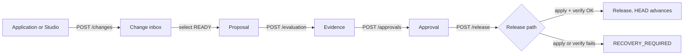

# Product and workflows

Status: current as of the code in `runtime/` and `studio/`. Anything marked **Not implemented** is a real gap with a ticket reference.

---

## 1. What Gyrifi is

Gyrifi is a **governance layer for mutable AI context**. It sits between the systems that want to write to a vector store and the vector store itself, and it turns every write into a reviewable, verifiable, reversible unit of work.

Gyrifi is **not**:

- a vector database (Qdrant remains the corpus authority),
- a general workflow engine,
- a multi-tenant SaaS control plane,
- a replicated system (one Gyrifi process owns one `/data` repository).

---

## 2. Domain model

```text
Ledger
 ├── Change        (desired-state mutation, durable inbox)
 ├── Proposal      (ordered selection of Changes + evidence + approvals)
 │    ├── CheckResult   (evaluation evidence, bound to proposal hash)
 │    └── Approval      (human decision, bound to proposal hash)
 ├── ReleaseIntent (crash-recovery record for an in-flight target mutation)
 └── Release       (immutable, parent-linked; HEAD points at the newest)
```

### Ledger

A governed namespace. Has a unique `name`, a description, and exactly one `HEAD` row created with it. `HEAD.releaseId` is `""` until the first Release.

Ledgers are **not** scoped to a Qdrant collection today — the target collection is process-global via `GYRIFI_QDRANT_COLLECTION`. All Ledgers in one process govern the same collection.

### Change

One desired-state mutation of one **logical unit**. For the Qdrant adapter, the logical unit is the point ID.

| Field | Meaning |
|---|---|
| `unit` | Logical unit key (Qdrant point ID) |
| `action` | `PUT` or `DELETE` |
| `desired` | Complete desired JSON for `PUT`; `nil` for `DELETE` |
| `idempotencyKey` | Caller-supplied; unique per Ledger |
| `desiredFingerprint` | `sha256:` over canonicalised desired JSON |
| `requestFingerprint` | `sha256:` over `{unit, action, desired}` — used for idempotency equality |
| `sequence` | Monotonic per Ledger, assigned by the repository |
| `status` | `ACCEPTED` \| `READY` \| `INVALID` \| `RELEASED` |

**Current behaviour:** a newly accepted Change is inserted directly as `READY`. The `ACCEPTED` state and `baseFingerprint` capture exist in the model but are not produced by the acceptance path yet (GRF-221).

Changes are **desired-state**, not diffs. Two Changes to the same unit in one Proposal are not merged; the plan applies them in Proposal order.

### Proposal

An explicit, **ordered** selection of `READY` Changes. Creation:

- loads and validates every selected Change (`READY`, no duplicates),
- captures the current `HEAD.releaseId` as `baseReleaseId`,
- computes the deterministic hash,
- inserts the Proposal and a unique claim row per Change in one transaction.

The unique constraint on `proposal_changes.change_id` guarantees a Change belongs to **at most one** Proposal, ever. Claims are never released today — cancelling a Proposal is **not implemented** (GRF-212).

| Status | Meaning |
|---|---|
| `DRAFT` | Created, no evidence yet |
| `REVIEWED` | Reserved; not currently written by the Engine |
| `APPROVED` | Reserved; not currently written by the Engine |
| `RELEASED` | Set by `FinalizeRelease` |
| `BLOCKED` | Reserved |

Proposals are created as `DRAFT` and move straight to `RELEASED`. Studio derives review readiness from user actions, not from these statuses.

### Evaluation and evidence

Evaluation reads the Proposal's Changes, asks the target for a `Preview`, and builds an *effective proposed state* document:

```json
{ "proposal": {...}, "changes": [...], "preview": { "fidelity": "FAST", "summary": "..." } }
```

- **Inference disabled (default):** a deterministic check is recorded with `passed: true`, `kind: "deterministic"`, and the effective state as evidence.
- **Inference enabled:** the effective state plus the caller's `criteria` go to the provider; the typed result (`passed`, `summary`, `findings`, `model`) is recorded with `kind: "natural-language"`.

Every `CheckResult` stores `proposalId` **and** `proposalHash`. Evidence for a different hash is stale by construction.

Qdrant `Preview` fidelity is always `FAST` — it is a declared overlay summary, not a simulated query result.

### Approval

Recorded only when a **current passing** check exists for the Proposal's exact hash. Stores `actor` (defaults to `local-user`) and the Proposal hash. Unique on `(proposal_id, proposal_hash, actor)`.

There is **no authentication or authorisation** today — any caller can approve as any actor (GRF-220).

### Release and ReleaseIntent

A `ReleaseIntent` is the durable crash-recovery record. It holds the compiled plan (including before-image object hashes) and moves through:

```text
READY → APPLYING → VERIFYING → FINALIZED
                 ↘ RECOVERY_REQUIRED
```

A `Release` is immutable and parent-linked. It exists only after target apply **and** verify succeeded. `HEAD` advances in the same SQLite transaction that inserts it.

---

## 3. The primary workflow



### Step 1 — Accept a Change

`POST /api/v1/ledgers/{id}/changes`

1. Validate ledger ID, trim `unit` and `idempotencyKey`.
2. `PUT`: compact the desired JSON (invalid JSON ⇒ `INVALID_ARGUMENT`). `DELETE`: force `desired = nil`.
3. Compute `requestFingerprint`.
4. Look up the idempotency key:
   - found + same fingerprint ⇒ return the **existing** Change (still `202`),
   - found + different fingerprint ⇒ `CONFLICT`.
5. Validate the Change (`unit` required; `PUT` requires desired).
6. Write the desired bytes to the object store as kind `VALUE`.
7. Insert the Change row and commit.
8. Respond `202 Accepted`.

**No target I/O happens here.** The response is emitted only after commit.

### Step 2 — Create a Proposal

`POST /api/v1/ledgers/{id}/proposals` with `{ title, changeIds }`.

Fails with `CONFLICT` if any Change is not `READY` or is already claimed. Partial Proposals are impossible — the claim insert is transactional and all-or-nothing.

### Step 3 — Evaluate

`POST .../proposals/{id}/evaluation` with `{ criteria }`. Returns `{ passed, summary, previewFidelity, findings }` and persists a `CheckResult`.

Evaluation **never** mutates the target and **never** grants release authority.

### Step 4 — Approve

`POST .../proposals/{id}/approvals` with `{ actor }`. Refused with `CONFLICT` if no current passing check exists.

### Step 5 — Release

`POST .../proposals/{id}/release`. Serialized process-wide by a mutex. Steps, in order:

1. Load Proposal.
2. Require a current passing check **and** a current approval, else `CONFLICT`.
3. Require `HEAD.releaseId == proposal.baseReleaseId`, else `CONFLICT` ("Ledger HEAD moved").
4. Load the Changes and `target.Compile(...)` into a `Plan`.
5. For each operation: `target.Read(unit)` → record `expectedFingerprint`, `expectedExists`, `beforeExists`; if it exists, write the current value to the object store as kind `BEFORE_IMAGE` and record `beforeObjectHash`.
6. Persist the `ReleaseIntent` with the serialized plan, status `READY`.
7. Set intent `APPLYING`, call `target.Apply(plan)`. Failure ⇒ intent `RECOVERY_REQUIRED`, `UNAVAILABLE`.
8. Set intent `VERIFYING`, call `target.Verify(plan)`. Failure ⇒ intent `RECOVERY_REQUIRED`, `UNAVAILABLE`.
9. Build the `Release` (`parentId = head.releaseId`), then `FinalizeRelease` in **one** transaction: insert Release, set `HEAD`, mark Proposal `RELEASED`, mark Changes `RELEASED`, mark intent `FINALIZED`.

### Step 6 — Recovery on startup

`RecoverReleases` runs before the HTTP listener starts:

- intents still in `READY` are skipped (no target mutation was attempted),
- otherwise the plan is re-verified; if it verifies, the Release is finalized; if not, the intent becomes `RECOVERY_REQUIRED`.

Recovery **never guesses success**. There is currently no API or UI to inspect or resolve `RECOVERY_REQUIRED` intents (GRF-213).

---

## 4. Rollback workflow

Rollback never rewinds `HEAD`. To restore the state represented by an older Release `Rn`:

1. List Releases newest-first. Locate `Rn`; refuse if it is already `HEAD` (`CONFLICT`).
2. Walk every Release **newer** than `Rn`. For each, load its `ReleaseIntent` plan.
3. For each operation in those plans, resolve the retained before-image:
   - `beforeExists = true` ⇒ read `beforeObjectHash` ⇒ restore state is `PUT <before value>`,
   - `beforeExists = false` ⇒ restore state is `DELETE`.
4. Reduce by unit — because the walk goes newest-first through the release list, the **oldest** touching release wins, which is the state as of `Rn`.
5. Sort units lexicographically and create one ordinary Change per unit, with the synthetic idempotency key `rollback:{headReleaseId}:{targetReleaseId}:{unit}`.
6. Create a new Proposal titled `Restore state from {targetReleaseId}` on the current `HEAD`.

The result goes through normal evaluation, approval, and release. History becomes `R1 → R2 → R3 → R4`, where `R4` restores what `R1` represented.

If a required before-image object is missing or corrupt, rollback fails with `INTERNAL` rather than fabricating state.

---

## 5. Governance invariants

These are enforced by code and tests. **Do not weaken any of them.**

| # | Invariant | Enforced by |
|---|---|---|
| 1 | An acknowledged Change is durably in SQLite before the response | `CreateChange` commits before returning |
| 2 | One `(ledger, idempotencyKey)` maps to one logical request forever | `UNIQUE (ledger_id, idempotency_key)` + `requestFingerprint` comparison |
| 3 | A Change belongs to one Ledger and one logical unit | schema FK + `ValidateChange` |
| 4 | A Change is claimed by at most one Proposal | `UNIQUE (change_id)` on `proposal_changes` |
| 5 | Proposal membership is explicit and ordered | `proposal_changes.ordinal` |
| 6 | Proposal identity = ledger + base HEAD + ordered Change IDs | `ledger.ProposalHash` |
| 7 | Checks and approvals match the current Proposal hash or are stale | `proposal_hash` column on both tables |
| 8 | Evaluation never mutates the target, never authorises release | `EvaluateProposal` only calls `Preview` |
| 9 | Release validates current HEAD before applying | `head.ReleaseID != proposal.BaseReleaseID` ⇒ conflict |
| 10 | A persisted Intent and before-images exist before target mutation | `SaveReleaseIntent` precedes `Apply` |
| 11 | `HEAD` advances only after verification succeeds | `FinalizeRelease` runs after `Verify` |
| 12 | Unfinished application is recovered or flagged, never assumed successful | `RecoverReleases` |
| 13 | Only the release path calls `TargetAdapter.Apply` / `Restore` | code review + layering rules |
| 14 | Releases are immutable and parent-linked | no update path; `parent_id` column |
| 15 | Rollback creates forward history | `CreateRollbackProposal` |
| 16 | Object representation never changes logical hashes | CAS write is content-addressed and idempotent |
| 17 | Governance works with inference disabled | `engine.inference == nil` branch |

---

## 6. Studio product surface

Four top-level areas, nothing else:

| Area | Purpose |
|---|---|
| **Ledgers** | Create and select the active Ledger. Selection persists in `localStorage` under `gyrifi.ledger`. |
| **Changes** | Durable inbox view plus a form to submit desired state. |
| **Proposals** | Review queue. Build a Proposal from `READY` Changes; run Evaluate / Approve / Release. |
| **Releases** | Immutable history. Trigger rollback from any non-HEAD Release. |

There are deliberately **no** top-level pages for SQLite, object storage, target operations, inference processes, or Release Intents. Those are implementation concerns, not product concerns. Release Intent *recovery* is the one exception and belongs **inside** Releases (GRF-213).

The Studio topbar exposes the selected Ledger switcher, the current HEAD Release when one exists, and a server-probed runtime state. Ledger selection remains a local preference (`localStorage["gyrifi.ledger"]`); the Ledger list, HEAD, version, and inference mode are API-backed.

---

## 7. Known product gaps

| Gap | Ticket |
|---|---|
| Live event stream is a keepalive stub; Studio never refreshes automatically | GRF-210 |
| No Proposal detail view; evidence and findings cannot be read back | GRF-211 |
| Proposals cannot be cancelled; claimed Changes are stuck forever | GRF-212 |
| `RECOVERY_REQUIRED` intents are invisible and unresolvable | GRF-213 |
| List endpoints are unbounded and unfiltered | GRF-214 |
| No authentication; anyone can approve and release | GRF-220 |
| `baseFingerprint` is never captured; no async Change preparation | GRF-221 |
| No retention limits, quotas, or backup command | GRF-222 |
| Evaluation criteria is hardcoded in Studio | GRF-207 |
| Ledgers and Changes are create-only — a mistaken ingestion is permanent | GRF-215 |
| No liveness or readiness signal an orchestrator can use | GRF-224 |
| The inference child process is unsupervised and its output is discarded | GRF-225 |
| No rate limiting — one client can starve every other | GRF-226 |
