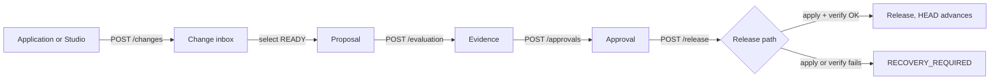

# Product and workflows

Status: current as of the code in `runtime/` and `studio/`. Anything marked **Not implemented** is a real gap with a ticket reference.

---

## 1. What Gyrifi is

Gyrifi is a **governance layer for mutable AI context**. It sits between the systems that want to write to a vector store and the vector store itself, and it turns every write into a reviewable, verifiable, reversible unit of work.

Gyrifi is **not**:

- a vector database (Qdrant remains the corpus authority),
- a general workflow engine,
- a multi-tenant SaaS control plane,
- a replicated system (one Gyrifi process owns one `/data` repository).

Gyrifi is deployed inside a trusted company VM, private VPC, VPN, service mesh, or authenticated reverse proxy. It has no application-level authentication or authorisation; every admitted caller has full governance authority. Public-internet exposure is unsupported. See [ADR 0002](../adr/0002-authentication-model.md).

---

## 2. Domain model

```text
Ledger
 ├── Change        (desired-state mutation, durable inbox)
 ├── Proposal      (ordered selection of Changes + evidence + approvals)
 │    ├── CheckResult   (evaluation evidence, bound to proposal hash)
 │    └── Approval      (human decision, bound to proposal hash)
 ├── ReleaseIntent (crash-recovery record for an in-flight target mutation)
 └── Release       (immutable, parent-linked; HEAD points at the newest)
```

### Ledger

A governed namespace. Has a unique `name`, a description, and exactly one `HEAD` row created with it. `HEAD.releaseId` is `""` until the first Release. A nullable `archivedAt` retires the Ledger from the working set without hiding history; unarchiving clears it.

Ledgers are **not** scoped to a Qdrant collection today — the target collection is process-global via `GYRIFI_QDRANT_COLLECTION`. All Ledgers in one process govern the same collection.

### Change

One desired-state mutation of one **logical unit**. For the Qdrant adapter, the logical unit is the point ID.

| Field | Meaning |
|---|---|
| `unit` | Logical unit key (Qdrant point ID) |
| `action` | `PUT` or `DELETE` |
| `desired` | Complete desired JSON for `PUT`; `nil` for `DELETE` |
| `idempotencyKey` | Caller-supplied; unique per Ledger |
| `desiredFingerprint` | `sha256:` over canonicalised desired JSON |
| `requestFingerprint` | `sha256:` over `{unit, action, desired}` — used for idempotency equality |
| `sequence` | Monotonic per Ledger, assigned by the repository |
| `status` | `ACCEPTED` \| `READY` \| `INVALID` \| `RELEASED` \| `WITHDRAWN` |

New Changes are durably inserted as `ACCEPTED`. The background preparation worker observes the target outside any database transaction, then records `baseFingerprint` and transitions the Change to `READY`, or to `INVALID` only for an adapter-reported semantic rejection. Matching PUTs and absent DELETEs remain `READY` with `noop=true`; retry exhaustion remains `ACCEPTED` with `stalled=true`.

Changes are **desired-state**, not diffs. Two Changes to the same unit in one Proposal are not merged; the plan applies them in Proposal order.

Withdrawal is a terminal, recorded intent transition for unreleased Changes. It retains the row and idempotency key, records `withdrawn_at` and a required `withdrawn_reason`, hides the Change from the default inbox, and prevents Proposal selection. A released Change can never be withdrawn; a claimed Change must first be released by cancelling its Draft Proposal.

### Proposal

An explicit, **ordered** selection of `READY` Changes. Creation:

- loads and validates every selected Change (`READY`, no duplicates),
- captures the current `HEAD.releaseId` as `baseReleaseId`,
- computes the deterministic hash,
- inserts the Proposal and a unique claim row per Change in one transaction.

The unique constraint on `proposal_changes.change_id` guarantees a Change is claimed by **at most one active** Proposal. Cancelling a Draft Proposal deletes only those claim rows, while the ordered `proposals.change_ids` snapshot keeps its historical membership readable and lets the Changes be selected into a replacement Proposal.

| Status | Meaning |
|---|---|
| `DRAFT` | Created, no evidence yet |
| `REVIEWED` | The latest saved evaluation passed |
| `APPROVED` | An approval was saved for the current Proposal hash |
| `RELEASED` | Set by `FinalizeRelease` |
| `BLOCKED` | The latest saved evaluation failed |
| `CANCELLED` | Intentionally ended before release; membership, evidence, and approvals remain readable, but claims are released |

Proposal status is a display summary, not release authority. Release gates query current hash-bound passing evidence and approvals directly, plus the current Ledger HEAD; a status value alone never authorises a release.

Cancellation is Draft-only and terminal. It is idempotent, cannot proceed after any Release Intent exists, and never deletes the Proposal, its immutable membership snapshot, checks, or approvals. The affected Changes remain `READY`.

### Evaluation and evidence

Evaluation reads the Proposal's Changes, asks the target for a `Preview`, and builds an *effective proposed state* document:

```json
{ "proposal": {...}, "changes": [...], "preview": { "fidelity": "FAST", "summary": "..." } }
```

- **Inference disabled (default):** a deterministic check is recorded with `passed: true`, `kind: "deterministic"`, and the effective state as evidence.
- **Inference enabled:** the effective state plus the caller's `criteria` go to the provider; the typed result (`passed`, `summary`, `findings`, `model`) is recorded with `kind: "natural-language"`.

Every `CheckResult` stores `proposalId` **and** `proposalHash`. Evidence for a different hash is stale by construction.

Qdrant `Preview` fidelity is always `FAST` — it is a declared overlay summary, not a simulated query result.

### Approval

Recorded only when a **current passing** check exists for the Proposal's exact hash. Stores `actor` (defaults to `local-user`) and the Proposal hash. Unique on `(proposal_id, proposal_hash, actor)`.

There is no application authentication. Under ADR 0002, the deployment boundary admits trusted callers and `actor` remains caller-asserted attribution rather than a verified identity.

### Release and ReleaseIntent

A `ReleaseIntent` is the durable crash-recovery record. It holds the compiled plan (including before-image object hashes) and moves through:

```text
READY → APPLYING → VERIFYING → FINALIZED
                 ↘ RECOVERY_REQUIRED
                    ↘ ABANDONED
```

A `Release` is immutable and parent-linked. It exists only after target apply **and** verify succeeded. `HEAD` advances in the same SQLite transaction that inserts it.

---

## 3. The primary workflow



### Step 1 — Accept a Change

`POST /api/v1/ledgers/{id}/changes`

1. Validate ledger ID, trim `unit` and `idempotencyKey`.
2. `PUT`: compact the desired JSON (invalid JSON ⇒ `INVALID_ARGUMENT`). `DELETE`: force `desired = nil`.
3. Compute `requestFingerprint`.
4. Look up the idempotency key:
   - found + same fingerprint ⇒ return the **existing** Change (still `202`),
   - found + different fingerprint ⇒ `CONFLICT`.
5. Validate the Change (`unit` required; `PUT` requires desired).
6. Write the desired bytes to the object store as kind `VALUE`.
7. Insert the Change row and commit.
8. Respond `202 Accepted`.

**No target I/O happens here.** The response is emitted only after commit.

Archived Ledgers reject this mutation. `POST .../changes/{changeID}/withdraw` permits only `ACCEPTED`, `READY`, or `INVALID`, performs status and active-claim guards inside the write transaction, and returns `204`; an already-withdrawn Change is an idempotent success.

### Step 2 — Create a Proposal

`POST /api/v1/ledgers/{id}/proposals` with `{ title, changeIds }`.

Fails with `CONFLICT` if any Change is not `READY` or is already claimed. Partial Proposals are impossible — the claim insert is transactional and all-or-nothing.

Archived Ledgers reject Proposal creation. Archival itself is reversible but cannot begin while a Draft Proposal or non-terminal Release Intent exists. Archived Ledgers remain readable and reject new Changes, new Proposals, and rollback preparation.

### Step 3 — Evaluate

`POST .../proposals/{id}/evaluation` with `{ criteria }`. Returns `{ passed, summary, previewFidelity, findings }` and persists a `CheckResult`.

Evaluation **never** mutates the target and **never** grants release authority.

### Step 4 — Approve

`POST .../proposals/{id}/approvals` with `{ actor }`. Refused with `CONFLICT` if no current passing check exists.

### Step 5 — Release

`POST .../proposals/{id}/release`. Serialized process-wide by a mutex. Steps, in order:

1. Load Proposal.
2. Require a current passing check **and** a current approval, else `CONFLICT`.
3. Require `HEAD.releaseId == proposal.baseReleaseId`, else `CONFLICT` ("Ledger HEAD moved").
4. Load the Changes and `target.Compile(...)` into a `Plan`.
5. For each operation: `target.Read(unit)` → record `expectedFingerprint`, `expectedExists`, `beforeExists`; if it exists, write the current value to the object store as kind `BEFORE_IMAGE` and record `beforeObjectHash`.
6. Persist the `ReleaseIntent` with the serialized plan, status `READY`.
7. Set intent `APPLYING`, call `target.Apply(plan)`. Failure ⇒ intent `RECOVERY_REQUIRED`, `UNAVAILABLE`.
8. Set intent `VERIFYING`, call `target.Verify(plan)`. Failure ⇒ intent `RECOVERY_REQUIRED`, `UNAVAILABLE`.
9. Build the `Release` (`parentId = head.releaseId`), then `FinalizeRelease` in **one** transaction: insert Release, set `HEAD`, mark Proposal `RELEASED`, mark Changes `RELEASED`, mark intent `FINALIZED`.

### Step 6 — Recovery on startup

`RecoverReleases` runs before the HTTP listener starts:

- intents still in `READY` are skipped (no target mutation was attempted),
- otherwise the plan is re-verified; if it verifies, the Release is finalized; if not, the intent becomes `RECOVERY_REQUIRED`.

Recovery **never guesses success**. Intents that remain `RECOVERY_REQUIRED` are exposed through the operator recovery API and, in Studio, belong inside Releases.

### Step 7 — Operator recovery

Release Intent recovery is explicit and serialised with ordinary release work:

- `GET .../release-intents` lists the audit records newest-first; `GET .../release-intents/{intentID}` exposes the compiled Plan and reports whether each retained before-image is still present.
- `POST .../release-intents/{intentID}/retry` re-runs **verification only** and never re-applies. A passing verification uses the normal finalisation path and advances `HEAD` exactly once. A semantic mismatch returns `200` with `resolved: false` and unit-level expected/observed fingerprints; an unreachable target returns `503`.
- `POST .../release-intents/{intentID}/resolve` requires an operator-authored `ABANDONED` resolution and non-empty note. It records the resolution without advancing `HEAD` or changing the Proposal from its pre-release status.
- A Ledger with any `RECOVERY_REQUIRED` intent rejects new releases until retry succeeds or an operator abandons the intent. After abandonment and target repair, the same Proposal may be released again.

`RECOVERY_REQUIRED` therefore means the runtime cannot prove target state. Retry distinguishes a recoverable delayed verification from a semantic disagreement without issuing an unsafe write.

---

## 4. Rollback workflow

Rollback never rewinds `HEAD`. To restore the state represented by an older Release `Rn`:

1. List Releases newest-first. Locate `Rn`; refuse if it is already `HEAD` (`CONFLICT`).
2. Walk every Release **newer** than `Rn`. For each, load its `ReleaseIntent` plan.
3. For each operation in those plans, resolve the retained before-image:
   - `beforeExists = true` ⇒ read `beforeObjectHash` ⇒ restore state is `PUT <before value>`,
   - `beforeExists = false` ⇒ restore state is `DELETE`.
4. Reduce by unit — because the walk goes newest-first through the release list, the **oldest** touching release wins, which is the state as of `Rn`.
5. Sort units lexicographically and create one ordinary Change per unit, with the synthetic idempotency key `rollback:{headReleaseId}:{targetReleaseId}:{unit}`.
6. Create a new Proposal titled `Restore state from {targetReleaseId}` on the current `HEAD`.

The result goes through normal evaluation, approval, and release. History becomes `R1 → R2 → R3 → R4`, where `R4` restores what `R1` represented.

Studio explains this forward-history model before calling rollback. It computes the affected unit count from the Plans of every Release newer than the selected target, creates the rollback Proposal only after deliberate confirmation, and links directly to that Proposal for evaluation and approval. Release-plan drawers expose expected/desired fingerprints and whether required before-images are still retained.

If a required before-image object is missing or corrupt, rollback fails with `INTERNAL` rather than fabricating state.

---

## 5. Governance invariants

These are enforced by code and tests. **Do not weaken any of them.**

| # | Invariant | Enforced by |
|---|---|---|
| 1 | An acknowledged Change is durably in SQLite before the response | `CreateChange` commits before returning |
| 2 | One `(ledger, idempotencyKey)` maps to one logical request forever | `UNIQUE (ledger_id, idempotency_key)` + `requestFingerprint` comparison |
| 3 | A Change belongs to one Ledger and one logical unit | schema FK + `ValidateChange` |
| 4 | A Change is claimed by at most one active Proposal | `UNIQUE (change_id)` on `proposal_changes`; transactional claim deletion on cancellation |
| 5 | Proposal membership is explicit, ordered, and remains readable after claim release | `proposal_changes.ordinal` while active + immutable `proposals.change_ids` snapshot |
| 6 | Proposal identity = ledger + base HEAD + ordered Change IDs | `ledger.ProposalHash` |
| 7 | Checks and approvals match the current Proposal hash or are stale | `proposal_hash` column on both tables |
| 8 | Evaluation never mutates the target, never authorises release | `EvaluateProposal` only calls `Preview` |
| 9 | Release validates current HEAD before applying | `head.ReleaseID != proposal.BaseReleaseID` ⇒ conflict |
| 10 | A persisted Intent and before-images exist before target mutation | `SaveReleaseIntent` precedes `Apply` |
| 11 | `HEAD` advances only after verification succeeds | `FinalizeRelease` runs after `Verify` |
| 12 | Unfinished application is recovered or flagged, never assumed successful | `RecoverReleases` |
| 13 | Only the release path calls `TargetAdapter.Apply` / `Restore` | code review + layering rules |
| 14 | Releases are immutable and parent-linked | no update path; `parent_id` column |
| 15 | Rollback creates forward history | `CreateRollbackProposal` |
| 16 | Object representation never changes logical hashes | CAS write is content-addressed and idempotent |
| 17 | Governance works with inference disabled | `engine.inference == nil` branch |
| 18 | A Ledger cannot start another release while an Intent requires recovery | `ReleaseProposal` queries `RECOVERY_REQUIRED` intents before gate evaluation |
| 19 | Recovery retry verifies only; it never reapplies target writes | `RetryReleaseIntent` calls `TargetAdapter.Verify`, then the shared finalisation path |
| 20 | Abandonment is explicit, attributed with a note, and never advances `HEAD` | atomic `ResolveReleaseIntent` transition from `RECOVERY_REQUIRED` to `ABANDONED` |
| 21 | Withdrawal never erases a Change or its idempotency identity | transaction-safe status update guarded by `CanWithdrawChange`; no delete path |
| 22 | Released or actively claimed Changes cannot be withdrawn | in-transaction status and `proposal_changes` claim checks |
| 23 | Archival cannot strand in-flight governance work | in-transaction Draft Proposal and non-terminal Intent guards |
| 24 | Archived Ledgers are readable but reject new mutation and rollback work | repository write guards plus Engine rollback guard |

---

## 6. Studio product surface

Four top-level areas, nothing else:

| Area | Purpose |
|---|---|
| **Ledgers** | Create, select, archive, and unarchive Ledgers. The optional Archived view includes retired namespaces; the topbar working-set switcher does not. Selection persists in `localStorage` under `gyrifi.ledger`. |
| **Changes** | Durable inbox, PUT/DELETE submission, Change inspection and withdrawal, and the ordered selection flow that starts Proposal creation from `READY` Changes. |
| **Proposals** | Linkable two-pane review workspace for ordered Changes, user-authored evaluation evidence, hash-bound approval, confirmed release, Draft cancellation, and recovery guidance. |
| **Releases** | Immutable timeline and plans. Inspect/retry/abandon recovery Intents, or create a confirmed forward-history rollback Proposal from any non-HEAD Release. |

There are deliberately **no** top-level pages for SQLite, object storage, target operations, inference processes, or Release Intents. Those are implementation concerns, not product concerns. Release Intent *recovery* is the one exception and belongs **inside** Releases (GRF-213).

The Studio topbar exposes the selected Ledger switcher, the current HEAD Release when one exists, and a server-probed runtime state. Ledger selection remains a local preference (`localStorage["gyrifi.ledger"]`); the Ledger list, HEAD, version, and inference mode are API-backed.

---

## 7. Known product gaps

| Gap | Ticket |
|---|---|
| No retention limits, quotas, or backup command | GRF-222 |
| No rate limiting — one client can starve every other | GRF-226 |
